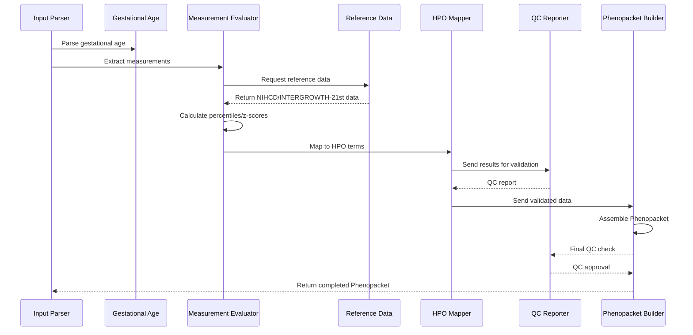
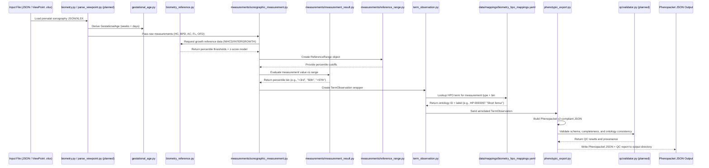
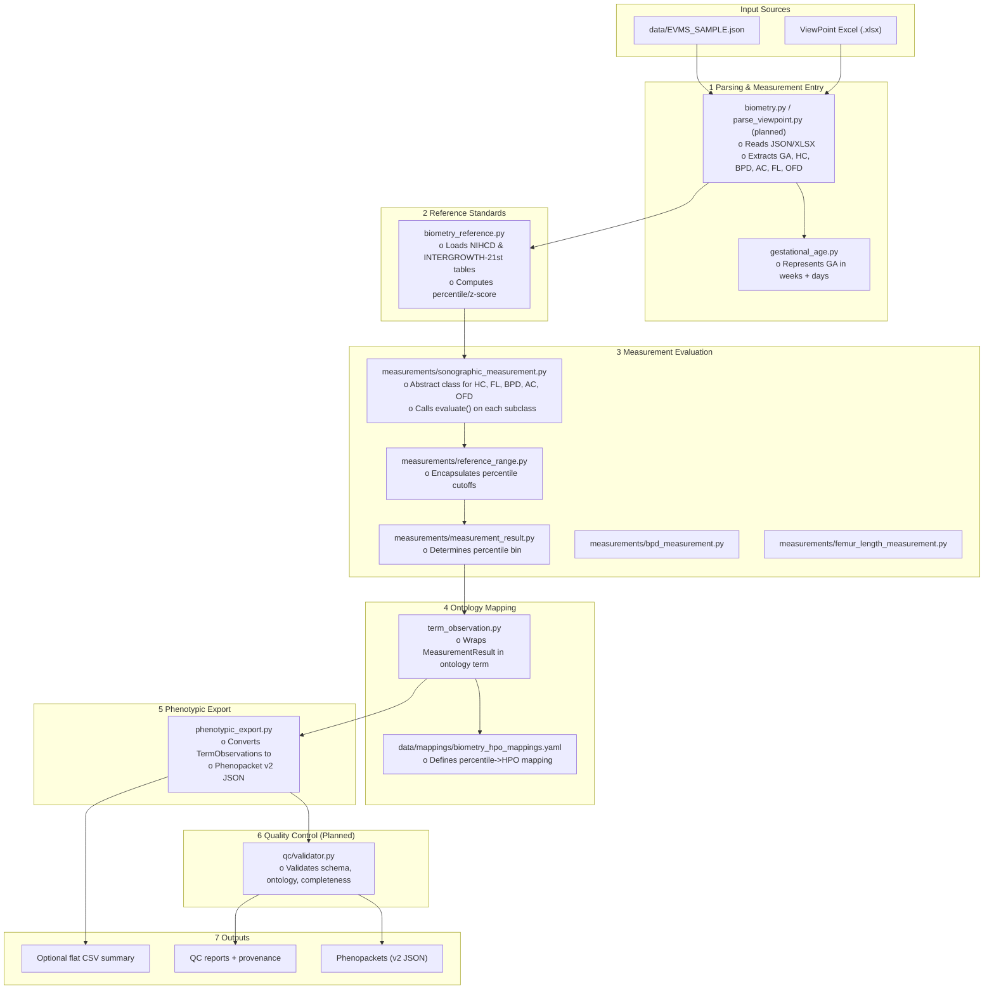

# prenatalppkt
==============

Library to transform raw sonography data into [Phenopackets](https://phenopacket-schema.readthedocs.io/) with validated fetal growth references (NIHCD and INTERGROWTH-21st).

Includes ontology-aware export utilities and YAML-based phenotype mappings.

-------------------------------------------------------------------------------
## Why
-------------------------------------------------------------------------------
- Standardize prenatal phenotype reporting for cases paired with WES/WGS.
- Enable federated repositories using consistent machine-readable formatting.
- Provide clinically valid percentile and z-score calculations from authoritative growth standards.

-------------------------------------------------------------------------------
## Overview of the Measurement System
-------------------------------------------------------------------------------

This release introduces a fully class-based architecture for sonographic measurement evaluation. It separates *numeric percentile classification* from *ontology mapping* while remaining fully compatible with downstream Phenopacket export.

Key updates:
- Added `phenotypic_export` module for Phenopacket v2 JSON assembly.
- Ontology mappings centralized in `data/mappings/biometry_hpo_mappings.yaml`.

-------------------------------------------------------------------------------
## Inputs and Outputs (at a glance)
-------------------------------------------------------------------------------
### Inputs
- **Observer JSON** (e.g. `data/EVMS_SAMPLE.json`)
- **ViewPoint Excel workbook** (`.xlsx` / `.xls`) with fetal biometry rows
- Typical sections:
   - * exam: DOB, LMP, GA by dates, exam date, ICD-10, referring clinicians
   - * fetuses[*]: anatomy blocks, measurements, vessels, procedures

### Outputs
- **Phenopackets (v2)**: one JSON per fetus (default) or per pregnancy (configurable)
   * subject: pseudo-ID for fetus; optional family link/pedigree
   * phenotypicFeatures: HPO terms with gestational onset (via ontology mapping)
   * measurements: BPD / HC / AC / FL / OFD, EFW, ratios
   * diseases: ICD-10 indications; optional MONDO/OMIM mappings
   * metaData: versioning, ontology versions, pipeline provenance
- **QC reports** per input record with structured issues
- **Optional flat CSV** with per-fetus features for downstream analysis

No command-line interface is provided in this release.

-------------------------------------------------------------------------------
## Simple Architecture
-------------------------------------------------------------------------------

         +-----------------------+
         | Input JSON / XLSX     |
         +-----------------------+
                   |
                   v
         +-----------------------+
         | Parser Layer          |
         | - Extracts GA, HC,    |
         |   BPD, AC, FL, OFD    |
         +-----------------------+
                   |
                   v
         +-----------------------+
         | Reference Lookup      |
         | - FetalGrowthPercent  |
         |   loads NIHCD/IG21st  |
         | - Percentile/Z-score  |
         +-----------------------+
                   |
                   v
         +-----------------------+
         | BiometryMeasurement   |
         | - Maps values to HPO  |
         | - Flags abnormalities |
         +-----------------------+
                   |
                   v
         +-----------------------+
         | Phenopacket Builder   |
         | - JSON assembly       |
         | - Metadata/QC log     |
         +-----------------------+
                   |
          +--------+--------+
          |                 |
          v                 v
 +----------------+   +----------------+
 | QC Reports     |   | Phenopackets   |
 +----------------+   +----------------+

New:
- `phenotypic_export.py` implements final Phenopacket generation.
- Ontology mappings now dynamically loaded from YAML.

Optional: extract flat CSV for statistical analysis.

-------------------------------------------------------------------------------
## Technical Flowchart and Diagrams
-------------------------------------------------------------------------------




-------------------------------------------------------------------------------
## New Core Measurement Layer (src/prenatalppkt/measurements)
-------------------------------------------------------------------------------

### Purpose
The new measurement layer provides a clean abstraction for evaluating fetal biometry values (e.g. head circumference, femur length) against percentile reference tables (NIHCD and INTERGROWTH-21)

Each measurement:
1. Uses a `ReferenceRange` to interpret raw values into percentile bins.
2. Produces a `MeasurementResult` describing that bin.
3. Can be wrapped in a `TermObservation` for ontology-aware reporting later.

### Files
- **`gestational_age.py`** - Represents gestational age as weeks and days.
- **`percentile.py`** - Enumerates key percentile cutoffs (3rd-97th).
- **`measurement_result.py`** - Encapsulates percentile bin classification and logic helpers.
- **`reference_range.py`** - Evaluates a measurement value against percentile thresholds.
- **`sonographic_measurement.py`** - Abstract base class for all biometric measures; defines unified evaluation flow and integration hooks.
- **`bpd_measurement.py`** - Example subclass for biparietal diameter.
- **`femur_length_measurement.py`** - Example subclass for femur length.
- **`term_observation.py`** - Wraps results in ontology-compatible structures (HPO and Phenopacket-ready).

### Highlights
- Clean separation of evaluation (numeric) and interpretation (ontology).
- Extensible to all biometric measurements (HC, AC, OFD, FL, EFW, etc.).
- Ready for dynamic reference loading (via `vj/parse_percentiles`).
- Fully tested with NIHCD thresholds at 20.86 weeks (BPD, FL examples).

-------------------------------------------------------------------------------
## Core Components (src/prenatalppkt/)
-------------------------------------------------------------------------------
- `biometry.py`
  - Defines `BiometryMeasurement` and `BiometryType`. Wraps reference lookups and applies abnormality logic (<=3rd percentile or >=97th percentile) to assign HPO terms.

- `biometry_reference.py`
  - Provides `FetalGrowthPercentiles`, which loads validated growth tables.
  - Supports:
     - * INTERGROWTH-21st (centiles + z-scores for HC, BPD, AC, FL, OFD).
     - * NICHD (percentiles for HC, BPD, AC, FL, EFW).

- `constants.py`
  Defines ontology mappings (e.g. HPO_MICROCEPHALY = HP:0000252).

- `qc/` (planned)
  Will validate completeness, gestational ages, duplicate measures, and flag out-of-range data.

- `phenopacket_builder/` (planned)
  Will convert parsed + annotated measurements into full [GA4GH Phenopacket v2](https://phenopacket-schema.readthedocs.io/en/latest/) JSONs.

Together:
**Inputs -> parsed measurements -> percentile/z-score lookup -> abnormality detection (HPO terms) -> structured Phenopacket**

-------------------------------------------------------------------------------
## Mapping to Phenopackets
-------------------------------------------------------------------------------
Our mapping strategy combines biometric reference lookups with ontology terms:

1. **Parse biometry** from JSON/XLSX. Extract GA (weeks) and raw measurement values (mm).
2. **Reference lookup** with `FetalGrowthPercentiles`:
* Find percentile for the measurement at given GA.
* Compute z-score (if INTERGROWTH source).
3. **Abnormality thresholds**:
* If value <=3rd percentile -> assign *small/short* phenotype HPO (e.g. microcephaly, short femur).
* If value >=97th percentile -> assign *large/long* phenotype HPO (e.g. macrocephaly, long femur).
* Otherwise, no HPO abnormality.
4. **Assemble Phenopacket**:
* `subject`: pseudo-ID for fetus.
* `phenotypicFeatures`: HPO terms with `onset=GA`.
* `measurements`: raw values + units, linked to ontology type.
* `diseases`: ICD-10 indications from input.
* `metaData`: pipeline + version information.

This ensures **machine-readable, clinically valid prenatal phenotyping** from raw sonography.

-------------------------------------------------------------------------------
## Phenotypic Export Layer
-------------------------------------------------------------------------------
Integrates `MeasurementResult` and `TermObservation` objects into GA4GH Phenopacket v2 JSONs.
Implements structured provenance, ontology versioning, and per-feature gestational context.
Unit tested in `tests/test_phenotypic_export.py`.

-------------------------------------------------------------------------------
## Example Usage
-------------------------------------------------------------------------------
```python
from prenatalppkt.biometry import BiometryMeasurement, BiometryType
from prenatalppkt.biometry_reference import FetalGrowthPercentiles

fg = FetalGrowthPercentiles(source="intergrowth")

measure = BiometryMeasurement(
  measurement_type=BiometryType.HEAD_CIRCUMFERENCE,
  gestational_age_weeks=22,
  value_mm=196.3,
)

percentile, hpo = measure.percentile_and_hpo(reference=fg)
print(percentile, hpo)
# Example: 50.0, None

```

-------------------------------------------------------------------------------
## Example Usage of Measurement Layer
-------------------------------------------------------------------------------  

```python
from prenatalppkt.gestational_age import GestationalAge
from prenatalppkt.measurements.reference_range import ReferenceRange
from prenatalppkt.measurements.bpd_measurement import BiparietalDiameterMeasurement

# Example NIHCD BPD percentiles (20.86 weeks, Non-Hispanic White)
thresholds = [145.25, 147.25, 150.37, 161.95, 174.41, 178.12, 180.56]
ga = GestationalAge.from_weeks(20.86)
reference = ReferenceRange(gestational_age=ga, percentiles=thresholds)

# Evaluate a measurement (in mm)
bpd = BiparietalDiameterMeasurement()
observation = bpd.evaluate(gestational_age=ga, measurement_value=170.0, reference_range=reference)

print(observation)
# -> TermObservation(hpo_label='None', observed=False, excluded=True, gestational_age=20w6d)
```

The same API applies to any measurement subclass. Future releases will link these evaluations to ontology mappings once percentile tables are fully parsed and harmonized.

## Testing
-------------

### Test Coverage

Tests verify core functionality across multiple domains:

- Growth pattern validation (HC, BPD, AC, FL, OFD)
- Z-score calculations (INTERGROWTH-21st reference)
- Edge case handling:
  * Missing reference data
  * Unsupported measurement types
  * Interpolation for non-tabled gestational ages
- Documentation validation
  * Reference data documentation
  * Parsing workflow verification
  * Usage notes checking

### Running Tests

```bash
# Run linting and tests:
ruff format . && ruff check . --fix && pytest -vv

# Test coverage includes:
# - Normal vs abnormal growth patterns
# - Z-score lookup accuracy
# - Edge case handling
# - Documentation consistency
```

### Documentation Status

Current documentation covers:
- Data provenance
- Parsing workflow
- Usage notes

Future documentation planned:
- Input parsers
- QC pipeline
  - **QC reports** per input record with structured issues
  - **Optional flat CSV** with per-fetus features for downstream analysis
- End-to-end phenopacket export
- CLI quick start guide

### CLI quick start (planned):
 prenatalppkt parse --input mydata.xlsx --output outdir/


-------------------------------------------------------------------------------
## Rough Roadmap
-------------------------------------------------------------------------------



