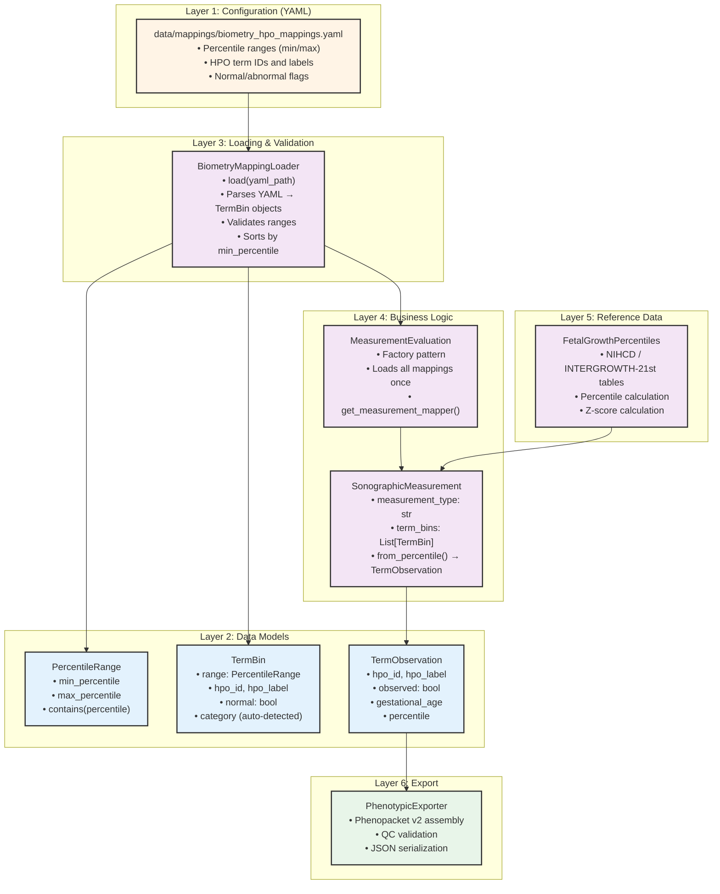
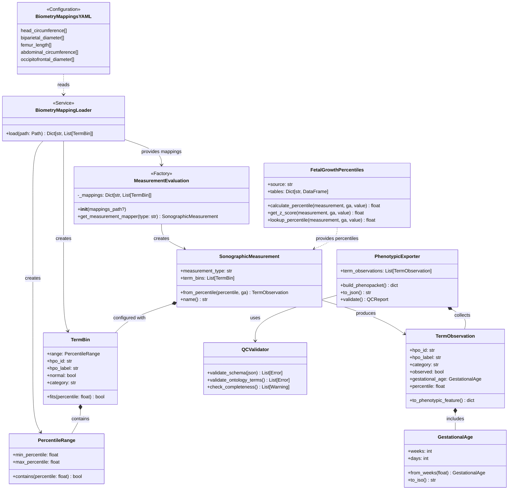
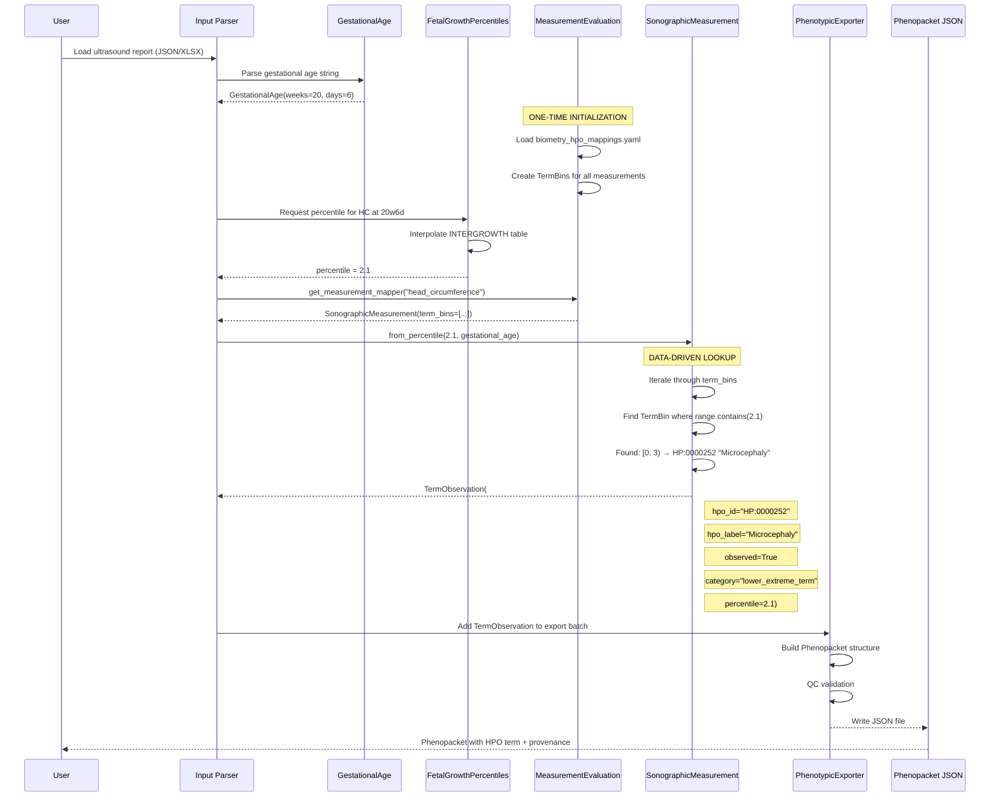
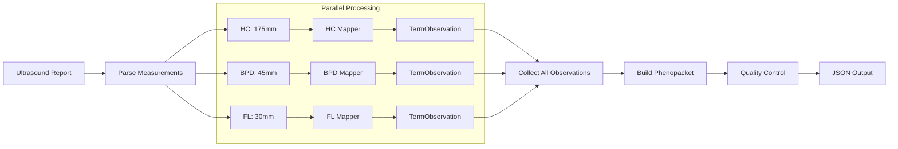
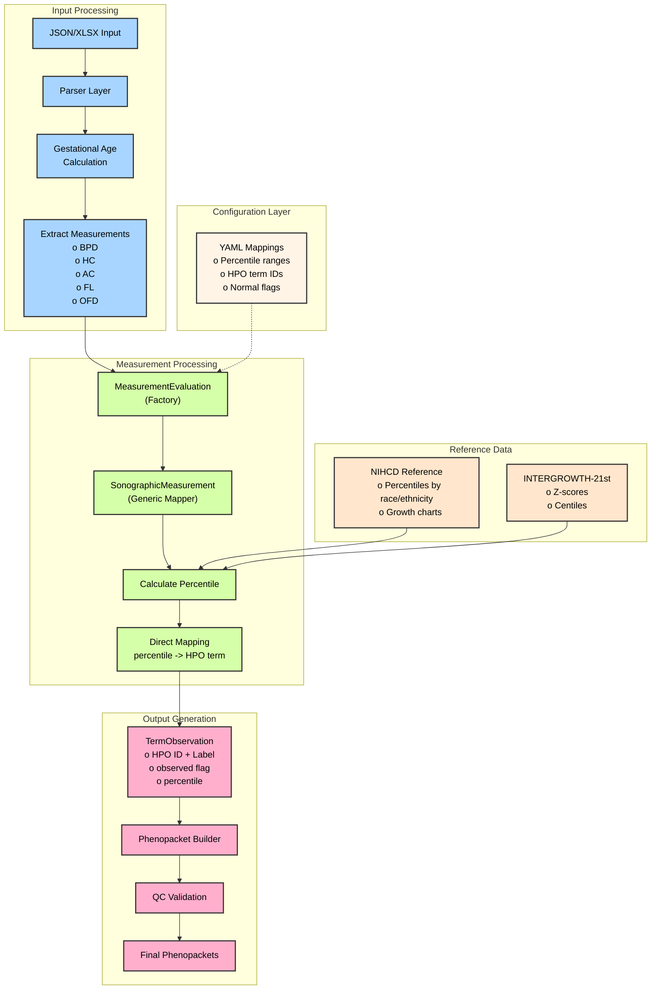
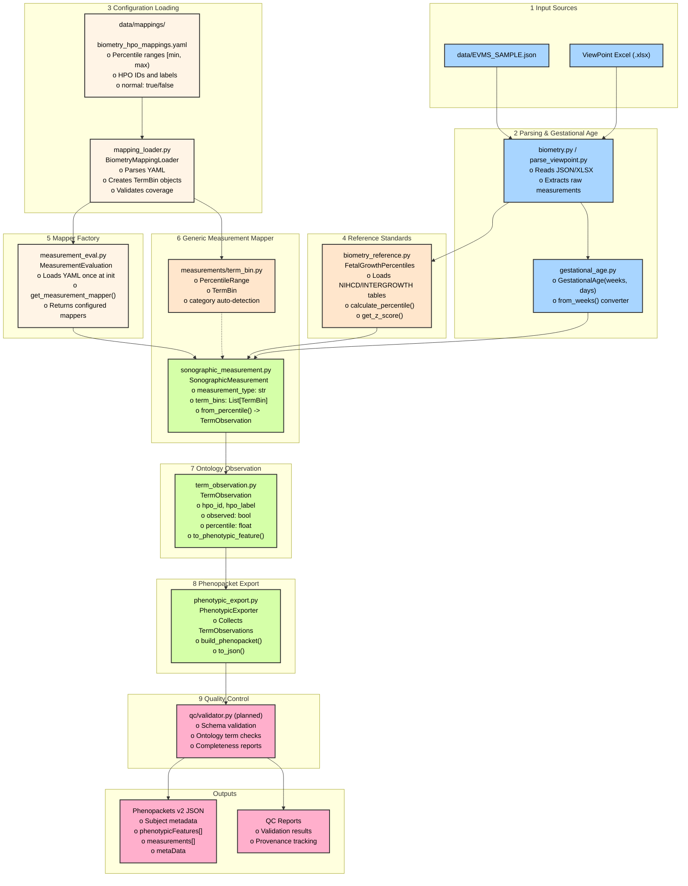
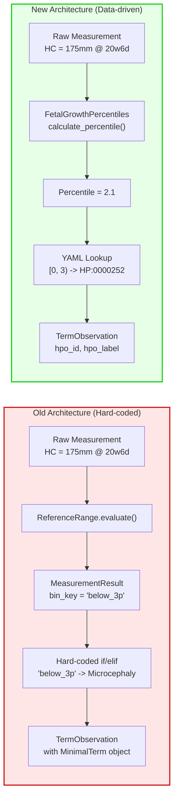
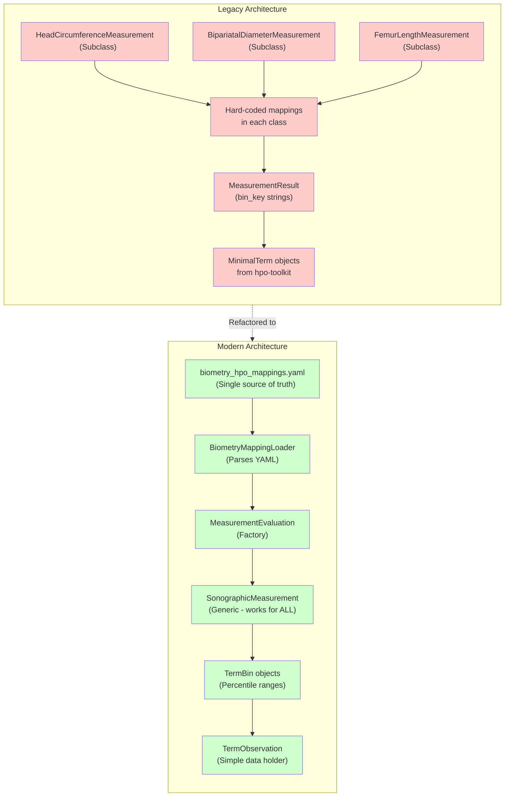
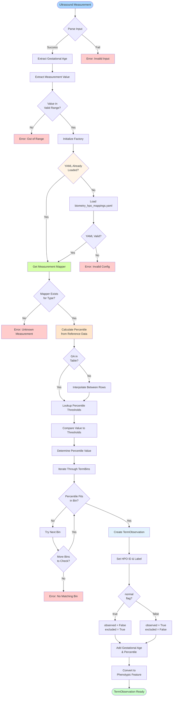
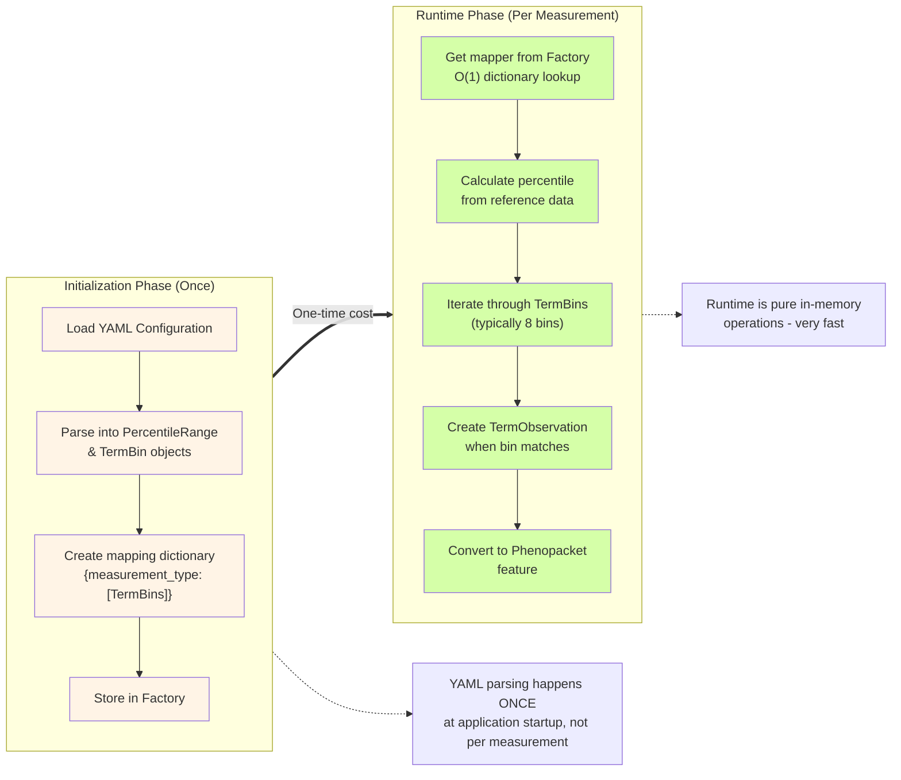

# prenatalppkt

A Python library for transforming raw prenatal sonography data into standardized [GA4GH Phenopackets (v2)](https://phenopacket-schema.readthedocs.io/) with clinically validated fetal growth references from NIHCD and INTERGROWTH-21st.

---

## Table of Contents

1. [Overview](#overview)
2. [Motivation](#motivation)
3. [Architecture](#architecture)
4. [Data Flow](#data-flow)
5. [Module Breakdown](#module-breakdown)
6. [Configuration Guide](#configuration-guide)
7. [Inputs and Outputs](#inputs-and-outputs)
8. [Installation](#installation)
9. [Usage Examples](#usage-examples)
10. [Testing](#testing)
11. [Future Roadmap](#future-roadmap)
12. [Contributing](#contributing)
13. [License](#license)
14. [Acknowledgments](#acknowledgments)
15. [Citation](#citation)
16. [Support](#support)
17. [Visuals](#visuals)

---

## Overview

`prenatalppkt` bridges the gap between clinical prenatal ultrasound measurements and machine-readable, ontology-aware phenotype representations. The library:

- **Standardizes biometric data** from multiple ultrasound reporting systems (Observer JSON, ViewPoint Excel)
- **Evaluates measurements** against authoritative growth references (NIHCD and INTERGROWTH-21st)
- **Maps percentile classifications** to Human Phenotype Ontology (HPO) terms
- **Generates GA4GH Phenopackets** with complete provenance and metadata

This enables federated genomic repositories to integrate prenatal phenotype data with whole exome/genome sequencing (WES/WGS) results in a consistent, computationally tractable format.

---

## Motivation

### Clinical Context

Prenatal ultrasound biometry provides critical developmental markers for fetal health assessment. Key measurements include:

- **Head Circumference (HC)**: Marker for brain development
- **Biparietal Diameter (BPD)**: Skull width measurement
- **Abdominal Circumference (AC)**: Indicates fetal nutrition status
- **Femur Length (FL)**: Long bone growth indicator
- **Occipito-Frontal Diameter (OFD)**: Alternative skull measurement
- **Estimated Fetal Weight (EFW)**: Overall growth assessment

### Technical Challenges

1. **Data heterogeneity**: Ultrasound systems export data in proprietary formats (ViewPoint Excel, Observer JSON)
2. **Reference ambiguity**: Multiple growth standards exist (NIHCD, INTERGROWTH-21st) with different population bases
3. **Ontology mapping**: Converting numeric percentiles to standardized phenotype terms requires domain expertise
4. **Genomic integration**: Linking prenatal observations to genetic data demands structured, machine-readable formats
5. **Maintainability**: Hard-coded mapping logic becomes brittle as clinical guidelines evolve

### Solution

`prenatalppkt` provides a unified, configuration-driven pipeline from raw measurements to Phenopackets, enabling:

- **Reproducible phenotype analysis** across institutions
- **Integration with genomic variant interpretation** workflows
- **Federated data sharing** with privacy-preserving pseudonymization
- **Flexible ontology mapping** through declarative YAML configuration
- **Longitudinal tracking** of fetal development

---

## Architecture

The system implements a **data-driven, configuration-based architecture** with clean separation between measurement evaluation, ontology mapping, and export logic.

### Core Design Principles

1. **Configuration over Code**: HPO term mappings are defined declaratively in YAML, not hard-coded in Python classes
2. **Dependency Injection**: Measurement evaluators receive configuration at instantiation, enabling flexible testing and deployment
3. **Single Responsibility**: Each component has one well-defined purpose
4. **Open/Closed Principle**: New measurements and mapping rules are added via configuration files, not code changes

### System Layers



### Key Architectural Change: Configuration-Driven Mapping

**OLD APPROACH** (Hard-coded):
```python
# Each measurement had its own class with hard-coded logic
class HeadCircumferenceMeasurement(SonographicMeasurement):
    def get_bin_to_term_mapping(self):
        return {
            "below_3p": MinimalTerm("HP:0000252", "Microcephaly"),
            "between_3p_5p": MinimalTerm("HP:0040195", "Decreased HC"),
            # ... 6 more hard-coded bins
        }
```

**NEW APPROACH** (Data-driven):
```yaml
# data/mappings/biometry_hpo_mappings.yaml
head_circumference:
  - min: 0
    max: 3
    id: "HP:0000252"
    label: "Microcephaly"
    normal: false
  
  - min: 3
    max: 5
    id: "HP:0040195"
    label: "Decreased head circumference"
    normal: false
  # ... all 8 ranges covering 0-100 percentile
```

```python
# Python code loads configuration, no hard-coding needed
factory = MeasurementEvaluation()  # Loads YAML once
mapper = factory.get_measurement_mapper("head_circumference")
observation = mapper.from_percentile(2.1, gestational_age)
# Returns: TermObservation(hpo_id="HP:0000252", hpo_label="Microcephaly", ...)
```

### System Class Diagram



---

## Data Flow

### End-to-End Processing Pipeline

The new architecture streamlines the flow from raw measurement to Phenopacket:



### Detailed Step-by-Step Flow

#### 1. Configuration Loading (Happens Once)

```
Application Startup
  ↓
MeasurementEvaluation.__init__()
  ↓
BiometryMappingLoader.load("biometry_hpo_mappings.yaml")
  ↓
Parse YAML → Create PercentileRange objects
  ↓
Create TermBin objects linking ranges to HPO terms
  ↓
Store in dictionary: {
    "head_circumference": [TermBin(...), TermBin(...), ...],
    "biparietal_diameter": [...],
    ...
}
```

#### 2. Measurement Processing (Per Observation)

```
Raw Input: HC = 175mm at 20 weeks 6 days
  ↓
GestationalAge.from_weeks(20.86)
  → GestationalAge(weeks=20, days=6)
  ↓
FetalGrowthPercentiles.calculate_percentile("head_circumference", 20.86, 175.0)
  → Lookup INTERGROWTH table
  → Interpolate between 20w and 21w rows
  → Return percentile: 2.1
  ↓
factory.get_measurement_mapper("head_circumference")
  → Returns SonographicMeasurement with 8 pre-configured TermBins
  ↓
mapper.from_percentile(2.1, gestational_age)
  → Loop through term_bins:
     - TermBin[0]: range=[0,3), hpo_id="HP:0000252" → MATCH!
  → Create TermObservation(
        hpo_id="HP:0000252",
        hpo_label="Microcephaly",
        category="lower_extreme_term",
        observed=True,  # normal=false in YAML
        gestational_age=GestationalAge(20, 6),
        percentile=2.1
    )
  ↓
TermObservation.to_phenotypic_feature()
  → {
      "type": {"id": "HP:0000252", "label": "Microcephaly"},
      "excluded": false,
      "onset": {"gestationalAge": {"weeks": 20, "days": 6}},
      "description": "Measurement at 20w6d"
    }
```

#### 3. Multi-Measurement Workflow



---

## Module Breakdown

### Core Architecture Modules

#### `src/prenatalppkt/measurements/term_bin.py`

Data structures for configuration-driven ontology mapping:

```python
@dataclass
class PercentileRange:
    """Represents a percentile interval [min, max)."""
    min_percentile: float
    max_percentile: float
    
    def contains(self, percentile: float) -> bool:
        """Check if percentile falls within this range."""
        return self.min_percentile <= percentile < self.max_percentile


@dataclass
class TermBin:
    """Links a percentile range to an HPO term."""
    range: PercentileRange
    hpo_id: str
    hpo_label: str
    normal: bool  # Explicit flag: is this range considered normal?
    
    def fits(self, percentile: float) -> bool:
        """Check if percentile fits in this bin."""
        return self.range.contains(percentile)
    
    @property
    def category(self) -> str:
        """Auto-categorize based on boundaries."""
        if self.range.min_percentile == 0:
            return "lower_extreme_term"
        elif self.range.max_percentile == 100:
            return "upper_extreme_term"
        elif self.normal:
            return "normal_term"
        else:
            return "abnormal_term"
```

**Purpose**: Pure data structures with no business logic. Can be easily serialized, tested, and validated.

---

#### `src/prenatalppkt/mapping_loader.py`

Handles all YAML parsing and TermBin construction:

```python
class BiometryMappingLoader:
    """
    Loads HPO mappings from YAML configuration.
    Separates file I/O from measurement evaluation logic.
    """
    
    @staticmethod
    def load(path: Path) -> Dict[str, List[TermBin]]:
        """
        Load biometry-to-HPO mappings from YAML.
        
        Returns:
            Dictionary mapping measurement types to sorted lists of TermBins
            
        Example:
            {
                "head_circumference": [
                    TermBin(range=[0,3), id="HP:0000252", ...),
                    TermBin(range=[3,5), id="HP:0040195", ...),
                    ...
                ],
                "biparietal_diameter": [...]
            }
        """
```

**Key Features**:
- Validates YAML structure
- Creates PercentileRange and TermBin objects
- Sorts bins by min_percentile for efficient lookup
- Logs warnings for gaps or overlaps
- Single point of failure for configuration errors

---

#### `src/prenatalppkt/measurement_eval.py`

Factory pattern for creating measurement evaluators:

```python
class MeasurementEvaluation:
    """
    Factory for measurement mappers.
    Loads configuration once, creates mappers on demand.
    """
    
    def __init__(self, mappings_path: Optional[Path] = None) -> None:
        """Initialize with YAML path (defaults to bundled config)."""
        self._mappings = BiometryMappingLoader.load(
            mappings_path or DEFAULT_MAPPINGS_FILE
        )
    
    def get_measurement_mapper(
        self, 
        measurement_type: str
    ) -> Optional[SonographicMeasurement]:
        """
        Get a configured mapper for the specified measurement.
        
        Example:
            factory = MeasurementEvaluation()
            hc_mapper = factory.get_measurement_mapper("head_circumference")
            observation = hc_mapper.from_percentile(2.1, gestational_age)
        """
```

**Design Pattern**: Factory + Singleton behavior (loads YAML once, reuses mappings)

---

#### `src/prenatalppkt/sonographic_measurement.py`

Generic measurement mapper (no longer abstract, no subclasses needed):

```python
class SonographicMeasurement:
    """
    Generic measurement mapper using configured TermBins.
    Replaces all measurement-specific subclasses.
    """
    
    def __init__(self, measurement_type: str, term_bins: List[TermBin]) -> None:
        """Configuration is INJECTED at instantiation."""
        self.measurement_type = measurement_type
        self.term_bins = term_bins
    
    def from_percentile(
        self, 
        percentile: float, 
        gestational_age: GestationalAge
    ) -> TermObservation:
        """
        Map a percentile to an HPO term observation.
        DATA-DRIVEN - no hard-coded if/elif chains!
        """
        for term_bin in self.term_bins:
            if term_bin.fits(percentile):
                return TermObservation(
                    hpo_id=term_bin.hpo_id,
                    hpo_label=term_bin.hpo_label,
                    category=term_bin.category,
                    observed=not term_bin.normal,
                    gestational_age=gestational_age,
                    percentile=percentile,
                )
        
        raise ValueError(
            f"No HPO mapping found for {self.measurement_type} "
            f"percentile {percentile:.1f}"
        )
```

**Key Change**: No more inheritance hierarchy! One generic class works for all measurements.

---

#### `src/prenatalppkt/term_observation.py`

Lightweight data holder (no complex logic or external dependencies):

```python
@dataclass
class TermObservation:
    """HPO term observation with gestational age context."""
    hpo_id: str
    hpo_label: str
    category: str
    observed: bool
    gestational_age: GestationalAge
    percentile: Optional[float] = None
    
    def to_phenotypic_feature(self) -> Dict[str, object]:
        """Convert to Phenopacket v2 format."""
        ga_str = f"{self.gestational_age.weeks}w{self.gestational_age.days}d"
        
        return {
            "type": {"id": self.hpo_id, "label": self.hpo_label},
            "excluded": not self.observed,
            "onset": {"gestationalAge": self.gestational_age.to_iso()},
            "description": f"Measurement at {ga_str}"
        }
```

**Removed Dependencies**:
- No longer depends on `MinimalTerm` from hpo-toolkit
- No `__post_init__` logic
- No `build_standard_bin_mapping()` method

---

### Reference Data Modules

#### `src/prenatalppkt/biometry_reference.py`

Unified interface for loading and querying fetal growth reference data:

```python
class FetalGrowthPercentiles:
    """
    Load and query NIHCD or INTERGROWTH-21st fetal growth references.
    
    Supports:
    - Percentile lookup by gestational age
    - Z-score calculation
    - Linear interpolation for non-integer gestational ages
    """
    
    def __init__(self, source: str = "intergrowth") -> None:
        """
        Initialize with reference data source.
        
        Args:
            source: "nihcd" or "intergrowth"
        """
    
    def calculate_percentile(
        self,
        measurement_type: str,
        gestational_age_weeks: float,
        value_mm: float
    ) -> float:
        """
        Calculate which percentile a measurement falls into.
        
        Returns:
            Percentile value (0-100)
        """
```

**Key features**:
- Loads parsed TSV tables from `data/parsed/`
- Handles gestational age interpolation
- Supports both centile and z-score tables
- Validates measurement types and ranges

---

#### `src/prenatalppkt/gestational_age.py`

Represents gestational age with weeks + days:

```python
@dataclass
class GestationalAge:
    """Gestational age representation."""
    weeks: int
    days: int
    
    @classmethod
    def from_weeks(cls, total_weeks: float) -> GestationalAge:
        """Convert decimal weeks to weeks+days."""
        weeks = int(total_weeks)
        days = int((total_weeks - weeks) * 7)
        return cls(weeks=weeks, days=days)
    
    def to_iso(self) -> dict:
        """Convert to Phenopacket ISO format."""
        return {"weeks": self.weeks, "days": self.days}
```

---

### Data Parsing Modules

#### `scripts/parse_nichd_raw.py`

Parses NIHCD raw text data into standardized TSV format:

```python
def parse_nichd_raw(input_file: Path, output_dir: Path) -> None:
    """
    Parse NIHCD fetal growth calculator text export.
    
    Handles:
    - Multi-word measurement names
    - Race/ethnicity categories
    - Multiple percentile columns
    - Header/footer junk lines
    """
```

---

#### `scripts/parse_intergrowth_txt_all.py`

Parses INTERGROWTH-21st centile and z-score tables:

```python
def parse_intergrowth_tables(raw_dir: Path, out_dir: Path) -> None:
    """
    Parse INTERGROWTH centile (_ct_) and z-score (_zs_) tables.
    
    Handles:
    - Text file parsing
    - Gestational age range validation
    - Measure name normalization
    - Provenance metadata
    """
```

---

### Export Modules

#### `src/prenatalppkt/phenotypic_export.py`

Assembles Phenopackets from TermObservations:

```python
class PhenotypicExporter:
    """
    Build GA4GH Phenopackets v2 from term observations.
    """
    
    def __init__(self) -> None:
        self.term_observations: List[TermObservation] = []
    
    def add_observation(self, obs: TermObservation) -> None:
        """Add an observation to the export batch."""
        self.term_observations.append(obs)
    
    def build_phenopacket(
        self,
        subject_id: str,
        maternal_id: Optional[str] = None
    ) -> dict:
        """
        Build complete Phenopacket structure.
        
        Returns:
            Phenopacket v2 compliant dictionary
        """
```

---

## Configuration Guide

### YAML Mapping Structure

The `data/mappings/biometry_hpo_mappings.yaml` file defines how percentile values map to HPO terms:

```yaml
# Template for each measurement
measurement_name:
  - min: <float>        # Minimum percentile (inclusive)
    max: <float>        # Maximum percentile (exclusive)
    id: "<HPO:ID>"      # HPO term identifier
    label: "<string>"   # Human-readable label
    normal: <boolean>   # Is this range considered normal?
```

### Complete Example: Head Circumference

```yaml
head_circumference:
  # Extreme low: <3rd percentile
  - min: 0
    max: 3
    id: "HP:0000252"
    label: "Microcephaly"
    normal: false
  
  # Borderline low: 3rd-5th percentile
  - min: 3
    max: 5
    id: "HP:0040195"
    label: "Decreased head circumference"
    normal: false
  
  # Mildly abnormal low: 5th-10th percentile
  - min: 5
    max: 10
    id: "HP:0000240"
    label: "Abnormality of skull size"
    normal: false
  
  # Normal range: 10th-50th percentile
  - min: 10
    max: 50
    id: "HP:0000240"
    label: "Abnormality of skull size"
    normal: true  # Marked as normal
  
  # Normal range: 50th-90th percentile
  - min: 50
    max: 90
    id: "HP:0000240"
    label: "Abnormality of skull size"
    normal: true
  
  # Mildly abnormal high: 90th-95th percentile
  - min: 90
    max: 95
    id: "HP:0000240"
    label: "Abnormality of skull size"
    normal: false
  
  # Borderline high: 95th-97th percentile
  - min: 95
    max: 97
    id: "HP:0040194"
    label: "Increased head circumference"
    normal: false
  
  # Extreme high: >97th percentile
  - min: 97
    max: 100
    id: "HP:0000256"
    label: "Macrocephaly"
    normal: false
```

### Validation Rules

The system automatically validates:

1. **Complete Coverage**: Ranges must span [0, 100) with no gaps
2. **No Overlaps**: Each percentile value must map to exactly one bin
3. **Sorted Order**: Ranges must be in ascending order by `min`
4. **Valid Percentiles**: `0 ≤ min < max ≤ 100`
5. **HPO Term Format**: IDs must match pattern `HP:\d{7}`

### Adding a New Measurement

```yaml
# 1. Add to biometry_hpo_mappings.yaml
estimated_fetal_weight:
  - min: 0
    max: 10
    id: "HP:0001518"
    label: "Small for gestational age"
    normal: false
  
  - min: 10
    max: 90
    id: "HP:0000118"  # Generic placeholder
    label: "Phenotypic abnormality"
    normal: true
  
  - min: 90
    max: 100
    id: "HP:0001520"
    label: "Large for gestational age"
    normal: false

# 2. Use immediately (no code changes needed!)
factory = MeasurementEvaluation()
efw_mapper = factory.get_measurement_mapper("estimated_fetal_weight")
```

### Customizing Normal Ranges

Different clinical contexts may define "normal" differently:

```yaml
# Conservative definition (narrower normal range)
head_circumference_conservative:
  - min: 0
    max: 5
    id: "HP:0000252"
    label: "Microcephaly"
    normal: false
  
  - min: 5
    max: 15    # More restrictive
    id: "HP:0040195"
    label: "Decreased head circumference"
    normal: false
  
  - min: 15
    max: 85    # Narrower normal range
    id: "HP:0000240"
    label: "Abnormality of skull size"
    normal: true
  
  # ... continue pattern
```

Load with:
```python
factory = MeasurementEvaluation(
    mappings_path=Path("config/conservative_mappings.yaml")
)
```

---

## Inputs and Outputs

### Input Formats

#### 1. Observer JSON

```json
{
  "exam": {
    "patient_dob": "1990-01-15",
    "lmp_date": "2024-03-10",
    "exam_date": "2024-08-15",
    "icd10_codes": ["Z34.00"]
  },
  "fetuses": [
    {
      "fetus_id": 1,
      "measurements": {
        "bpd_mm": 45.2,
        "hc_mm": 175.3,
        "ac_mm": 150.1,
        "fl_mm": 32.5
      },
      "anatomy": {
        "cranium": "normal",
        "heart": "four_chamber_view_normal"
      }
    }
  ]
}
```

#### 2. ViewPoint Excel (.xlsx)

| ExamDate   | LMP        | Fetus | BPD (mm) | HC (mm) | AC (mm) | FL (mm) |
| ---------- | ---------- | ----- | -------- | ------- | ------- | ------- |
| 2024-08-15 | 2024-03-10 | 1     | 45.2     | 175.3   | 150.1   | 32.5    |

**Note**: ViewPoint uses proprietary dropdown lists (`.vpl` files) for anatomy findings. See `docs/viewpoint_dropdown_options.md` for conversion utilities.

---

### Output Format: Phenopacket v2

```json
{
  "id": "prenatal-exam-20240815-fetus1",
  "subject": {
    "id": "FETUS_001",
    "timeAtLastEncounter": {
      "gestationalAge": {
        "weeks": 20,
        "days": 6
      }
    }
  },
  "phenotypicFeatures": [
    {
      "type": {
        "id": "HP:0000252",
        "label": "Microcephaly"
      },
      "excluded": false,
      "onset": {
        "gestationalAge": {
          "weeks": 20,
          "days": 6
        }
      },
      "description": "Measurement at 20w6d"
    },
    {
      "type": {
        "id": "HP:0000240",
        "label": "Abnormality of skull size"
      },
      "excluded": true,
      "onset": {
        "gestationalAge": {
          "weeks": 20,
          "days": 6
        }
      },
      "description": "Measurement within normal range for gestational age (20w6d)"
    }
  ],
  "measurements": [
    {
      "assay": {
        "id": "LOINC:11820-8",
        "label": "Head circumference"
      },
      "value": {
        "quantity": {
          "unit": {
            "id": "UCUM:mm",
            "label": "millimeter"
          },
          "value": 175.3
        }
      },
      "timeObserved": {
        "gestationalAge": {
          "weeks": 20,
          "days": 6
        }
      }
    }
  ],
  "metaData": {
    "created": "2024-08-15T14:30:00Z",
    "createdBy": "prenatalppkt-v0.1.0",
    "resources": [
      {
        "id": "hp",
        "name": "Human Phenotype Ontology",
        "url": "http://purl.obolibrary.org/obo/hp.owl",
        "version": "2024-04-26",
        "namespacePrefix": "HP",
        "iriPrefix": "http://purl.obolibrary.org/obo/HP_"
      },
      {
        "id": "intergrowth",
        "name": "INTERGROWTH-21st Standards",
        "url": "https://intergrowth21.tghn.org/",
        "version": "2014",
        "namespacePrefix": "INTERGROWTH"
      }
    ],
    "phenopacketSchemaVersion": "2.0"
  }
}
```

---

## Installation

### Prerequisites

- Python 3.10 or higher
- pip package manager

### Install from Source

```bash
# Clone the repository
git clone https://github.com/P2GX/prenatalppkt.git
cd prenatalppkt

# Create virtual environment
python3 -m venv venv
source venv/bin/activate  # On Windows: venv\Scripts\activate

# Install in development mode
pip install -e ".[test]"

# Verify installation
python -c "import prenatalppkt; print(prenatalppkt.__version__)"
```

### Install Dependencies Only

```bash
pip install -r requirements/requirements.txt
```

### Optional: Documentation Build

```bash
pip install -e ".[docs]"
mkdocs serve  # View docs at http://localhost:8000
```

---

## Usage Examples

### Basic Workflow

```python
from prenatalppkt.measurement_eval import MeasurementEvaluation
from prenatalppkt.biometry_reference import FetalGrowthPercentiles
from prenatalppkt.gestational_age import GestationalAge

# 1. Initialize (loads YAML configuration once)
factory = MeasurementEvaluation()
ref_data = FetalGrowthPercentiles(source="intergrowth")

# 2. Parse gestational age
ga = GestationalAge.from_weeks(20.86)  # 20 weeks, 6 days

# 3. Calculate percentile
percentile = ref_data.calculate_percentile(
    measurement_type="head_circumference",
    gestational_age_weeks=20.86,
    value_mm=175.0
)
# Returns: 2.1 (well below 3rd percentile)

# 4. Get measurement mapper
hc_mapper = factory.get_measurement_mapper("head_circumference")

# 5. Map to HPO term
observation = hc_mapper.from_percentile(percentile, ga)

# Result:
# TermObservation(
#     hpo_id="HP:0000252",
#     hpo_label="Microcephaly",
#     category="lower_extreme_term",
#     observed=True,
#     gestational_age=GestationalAge(weeks=20, days=6),
#     percentile=2.1
# )

# 6. Convert to Phenopacket format
phenotypic_feature = observation.to_phenotypic_feature()
# {
#     "type": {"id": "HP:0000252", "label": "Microcephaly"},
#     "excluded": false,
#     "onset": {"gestationalAge": {"weeks": 20, "days": 6}},
#     "description": "Measurement at 20w6d"
# }
```

### Batch Processing Multiple Measurements

```python
from prenatalppkt.measurement_eval import MeasurementEvaluation
from prenatalppkt.biometry_reference import FetalGrowthPercentiles
from prenatalppkt.gestational_age import GestationalAge

# Initialize once
factory = MeasurementEvaluation()
ref_data = FetalGrowthPercentiles(source="intergrowth")
ga = GestationalAge.from_weeks(22.5)

# Raw measurements from ultrasound
measurements = {
    "head_circumference": 196.3,
    "biparietal_diameter": 52.1,
    "femur_length": 35.8,
    "abdominal_circumference": 170.2
}

# Process all measurements
observations = []
for measurement_type, value_mm in measurements.items():
    # Calculate percentile
    percentile = ref_data.calculate_percentile(measurement_type, 22.5, value_mm)
    
    # Get mapper and create observation
    mapper = factory.get_measurement_mapper(measurement_type)
    obs = mapper.from_percentile(percentile, ga)
    observations.append(obs)

# Build Phenopacket
from prenatalppkt.phenotypic_export import PhenotypicExporter
exporter = PhenotypicExporter()
for obs in observations:
    exporter.add_observation(obs)

phenopacket = exporter.build_phenopacket(
    subject_id="FETUS_001",
    maternal_id="MOTHER_001"
)
```

### Custom Configuration

```python
from pathlib import Path
from prenatalppkt.measurement_eval import MeasurementEvaluation

# Use custom YAML configuration
custom_mappings = Path("config/custom_hpo_mappings.yaml")
factory = MeasurementEvaluation(mappings_path=custom_mappings)

# Rest of workflow is identical
mapper = factory.get_measurement_mapper("head_circumference")
observation = mapper.from_percentile(15.2, ga)
```

### Testing with Mock Configuration

```python
from prenatalppkt.measurements.term_bin import TermBin, PercentileRange
from prenatalppkt.sonographic_measurement import SonographicMeasurement
from prenatalppkt.gestational_age import GestationalAge

# Create mock configuration for testing
test_bins = [
    TermBin(
        range=PercentileRange(0, 10),
        hpo_id="HP:TEST001",
        hpo_label="Low test value",
        normal=False
    ),
    TermBin(
        range=PercentileRange(10, 90),
        hpo_id="HP:TEST002",
        hpo_label="Normal test value",
        normal=True
    ),
    TermBin(
        range=PercentileRange(90, 100),
        hpo_id="HP:TEST003",
        hpo_label="High test value",
        normal=False
    ),
]

# Create mapper with mock config
test_mapper = SonographicMeasurement("test_measurement", test_bins)

# Test with various percentiles
ga = GestationalAge(weeks=20, days=0)
obs_low = test_mapper.from_percentile(5.0, ga)
obs_normal = test_mapper.from_percentile(50.0, ga)
obs_high = test_mapper.from_percentile(95.0, ga)

assert obs_low.hpo_id == "HP:TEST001"
assert obs_low.observed == True

assert obs_normal.hpo_id == "HP:TEST002"
assert obs_normal.observed == False  # Normal range

assert obs_high.hpo_id == "HP:TEST003"
assert obs_high.observed == True
```

---

## Testing

### Run All Tests

```bash
pytest -vv
```

### Run Specific Test Module

```bash
pytest tests/test_term_bin.py -v
```

### Run with Coverage

```bash
pytest --cov=prenatalppkt --cov-report=html
```

### Linting and Formatting

```bash
# Format code
ruff format .

# Check for issues
ruff check .

# Auto-fix issues
ruff check . --fix
```

### Test Coverage

Current test suite covers:

#### Core Functionality Tests

**`tests/test_term_bin.py`**
- `PercentileRange.contains()` for various ranges
- `TermBin.fits()` boundary conditions
- Automatic category detection
- Edge cases (boundary values, overlaps)

**`tests/test_mapping_loader.py`**
- YAML file loading
- TermBin object creation
- Validation of range coverage
- Error handling for malformed YAML

**`tests/test_measurement_eval.py`**
- Factory initialization
- Mapper creation
- Configuration caching
- Missing measurement handling

**`tests/test_sonographic_measurement.py`**
- Percentile-to-observation mapping
- Data-driven lookup logic
- Normal vs. abnormal classification
- Edge percentiles (0.0, 99.9, etc.)

#### Reference Data Tests

**`tests/test_biometry_reference.py`**
- NIHCD table loading
- INTERGROWTH table loading
- Percentile interpolation accuracy
- Z-score calculation
- Cross-reference consistency

#### Export Tests

**`tests/test_phenotypic_export.py`**
- HPO term assignment correctness
- Phenopacket JSON serialization
- Batch export functionality
- QC validation integration

#### Parsing Tests

**`tests/test_parse_nichd_raw.py`**
- Header/junk line detection
- Multi-word measurement parsing
- Race/ethnicity field extraction
- Percentile value extraction

**`tests/test_parse_intergrowth_txt_all.py`**
- Data line identification
- GA range validation
- Measure name normalization
- Provenance metadata addition

### Test Data

Test fixtures use validated reference values:

```python
# Example: NIHCD BPD at 20.86 weeks (Non-Hispanic White)
NIHCD_BPD_20_86_WEEKS = {
    "3rd": 145.25,
    "5th": 147.25,
    "10th": 150.37,
    "50th": 161.95,
    "90th": 174.41,
    "95th": 178.12,
    "97th": 180.56
}

# Example: INTERGROWTH HC z-scores at 22 weeks
INTERGROWTH_HC_22_WEEKS_ZSCORES = {
    "-3 SD": 169.2,
    "-2 SD": 179.5,
    "-1 SD": 189.8,
    "0 SD": 200.1,
    "+1 SD": 210.4,
    "+2 SD": 220.7,
    "+3 SD": 231.0
}
```

---

## Future Roadmap

### Phase 1: Core Functionality ✅ (Current Release)

- [x] Reference data loading (NIHCD, INTERGROWTH-21st)
- [x] Percentile-based evaluation
- [x] HPO term mapping via YAML configuration
- [x] Data-driven measurement architecture
- [x] TermBin and PercentileRange models

### Phase 2: Input Parsing (In Progress)

- [ ] Observer JSON parser
- [ ] ViewPoint Excel parser
- [ ] Gestational age calculation from LMP/exam dates
- [ ] Multi-fetus handling
- [ ] Anatomy finding extraction (using ViewPoint dropdown lists)

### Phase 3: Quality Control (Planned)

- [ ] Schema validation (JSON Schema, Protobuf)
- [ ] Completeness checking (required fields, measurement coverage)
- [ ] Range validation (biologically plausible values)
- [ ] Anomaly detection (statistical outliers)
- [ ] Cross-measurement consistency (e.g., BPD/HC ratio)

### Phase 4: Phenopacket Builder (Planned)

- [ ] Full Phenopacket v2 assembly
- [ ] Family/pedigree integration (twins, triplets)
- [ ] ICD-10 → MONDO/OMIM mapping
- [ ] Provenance tracking (pipeline version, analyst ID)
- [ ] Batch export utilities

### Phase 5: CLI and Web API (Not Planned Yet)

```bash
# Command-line interface
prenatalppkt parse --input exam_data.json --output results/ --reference intergrowth

# Web API
POST /api/v1/evaluate
{
  "gestational_age_weeks": 22.5,
  "measurements": {"hc_mm": 196.3, "bpd_mm": 52.1}
}
→ Returns Phenopacket JSON
```

### Phase 6: Advanced Features (Not Planned Yet)

- [ ] Longitudinal growth tracking (serial ultrasounds)
- [ ] Growth velocity calculations
- [ ] Multi-parameter risk scoring
- [ ] Predictive modeling integration (machine learning)
- [ ] DICOM integration (extract measurements from ultrasound images)

---

## Contributing

We welcome contributions! Please see our [Contributing Guidelines](CONTRIBUTING.md) for details.

### Development Workflow

```bash
# 1. Fork and clone
git clone https://github.com/YOUR_USERNAME/prenatalppkt.git
cd prenatalppkt
git remote add upstream https://github.com/P2GX/prenatalppkt.git

# 2. Create feature branch
git checkout -b feature/add-efw-support

# 3. Install development dependencies
pip install -e ".[test]"

# 4. Make changes and test
pytest -vv
ruff format .
ruff check . --fix

# 5. Commit with descriptive messages
git add .
git commit -m "feat: Add estimated fetal weight (EFW) measurement support"

# 6. Push and create pull request
git push origin feature/add-efw-support
```

### Code Style Guidelines

- **Python**: Follow PEP 8 (enforced by Ruff)
- **Docstrings**: Use Sphinx format
- **Type hints**: Required for all public functions
- **Line length**: 88 characters (Black-compatible)

Example:

```python
def evaluate(
    self, 
    gestational_age: GestationalAge,
    measurement_value: float,
    reference_range: ReferenceRange
) -> MeasurementResult:
    """
    Evaluate a raw measurement against the provided reference range.

    Parameters
    ----------
    gestational_age : GestationalAge
        The gestational age context for this measurement.
    measurement_value : float
        The observed measurement in millimeters.
    reference_range : ReferenceRange
        Percentile thresholds for this gestational age.

    Returns
    -------
    MeasurementResult
        Percentile bin classification for the measurement.
    """
```

---

## LICENSE

```shell
## License

This project is released under a **dual-license model**:

- **Academic / Non-Commercial License:** Free to use, modify, and distribute for research and educational purposes.
- **Commercial License:** Required for commercial or for-profit use. Please contact [varenyajj@gmail.com](mailto:varenyajj@gmail.com).

Attribution required: (C) 2025 Varenya Jain, Peter N. Robinson.

For complete terms, see the [LICENSE](./LICENSE) file.
```

## Acknowledgments

Reference Standards

- NICHD Fetal Growth Studies: U.S. National Institute of Child Health and Human Development
- INTERGROWTH-21st Project: International consortium for fetal growth standards

Key Dependencies

- HPO Toolkit: Human Phenotype Ontology integration
- GA4GH Phenopackets: Standardized phenotype representation
- PyPhetools: Phenotype analysis utilities from Monarch Initiative

### Contributors

- [Varenya Jain](https://orcid.org/0009-0000-4429-6024)
- [Peter N. Robinson](https://orcid.org/0000-0002-0736-9199)


## Citation

If you use prenatalppkt in your research, please cite:

```bibtex
@article{prenatalppkt
   author = {Jain, Varenya and Robinson, Peter N.},
   title = {prenatalppkt: Standardized Prenatal Phenotype Representation},
   year = {2025},
   url = {https://github.com/P2GX/prenatalppkt},
   version = {0.1.dev}
}
```

And cite the relevant reference standards:

- **NICHD Fetal Growth Studies**: Buck Louis GM, Grewal J, Albert PS, Sciscione A, Wing DA, Grobman WA, Newman RB, Wapner R, D'Alton ME, Skupski D, Nageotte MP, Ranzini AC, Owen J, Chien EK, Craigo S, Hediger ML, Kim S, Zhang C, Grantz KL. Racial/ethnic standards for fetal growth: the NICHD Fetal Growth Studies. Am J Obstet Gynecol. 2015 Oct;213(4):449.e1-449.e41. doi: 10.1016/j.ajog.2015.08.032. PMID: 26410205; PMCID: PMC4584427.
- **INTERGROWTH-21st**: Papageorghiou AT, Kennedy SH, Salomon LJ, Altman DG, Ohuma EO, Stones W, Gravett MG, Barros FC, Victora C, Purwar M, Jaffer Y, Noble JA, Bertino E, Pang R, Cheikh Ismail L, Lambert A, Bhutta ZA, Villar J; International Fetal and Newborn Growth Consortium for the 21(st) Century (INTERGROWTH-21(st)). The INTERGROWTH-21st fetal growth standards: toward the global integration of pregnancy and pediatric care. Am J Obstet Gynecol. 2018 Feb;218(2S):S630-S640. doi: 10.1016/j.ajog.2018.01.011. PMID: 29422205.

```bibtex
@article{intergrowth2014,
   title={International standards for fetal growth based on serial ultrasound measurements: the INTERGROWTH-21st Project},
   author={Papageorghiou, Aris T and Ohuma, Eric O and others},
   journal={The Lancet},
   volume={384},
   number={9946},
   pages={869--879},
   year={2014},
   publisher={Elsevier}
}
```
```bibtex
@article{buck2015nichd,
 title={The NICHD Fetal Growth Studies: design, methods, and cohort description},
 author={Buck Louis, Germaine M and Grewal, Jagteshwar and others},
 journal={American Journal of Obstetrics and Gynecology},
 volume={213},
 number={4},
 pages={459--e1},
 year={2015}
}
```

## Support

```yaml
Documentation: https://github.com/P2GX/prenatalppkt/docs
Issue Tracker: https://github.com/P2GX/prenatalppkt/issues
Discussions: https://github.com/P2GX/prenatalppkt/discussions
Email: [Contact @VarenyaJ or @pnrobinson]
```

## Visuals:

### High-Level System Overview



**Key Differences from Legacy Architecture:**
- **YAML Configuration Layer**: Central source of truth for HPO mappings
- **Factory Pattern**: `MeasurementEvaluation` creates mappers on demand
- **Generic Mapper**: Single `SonographicMeasurement` class (no subclasses)
- **Direct Mapping**: No intermediate `MeasurementResult` - percentile maps directly to `TermObservation`
- **Explicit Normal Flags**: YAML defines what's normal, not hard-coded logic

### Detailed Module-Level Architecture



**Architecture Highlights:**

| Component | Old Approach | New Approach |
|-----------|-------------|--------------|
| **Ontology Mapping** | Hard-coded in subclasses | Declarative YAML configuration |
| **Measurement Classes** | One subclass per measurement (HC, BPD, FL...) | Single generic `SonographicMeasurement` |
| **Normal Range Logic** | Hard-coded if/else chains | Explicit `normal: true/false` in YAML |
| **Intermediate Results** | `MeasurementResult` with string bin keys | Direct percentile -> `TermObservation` |
| **Dependencies** | `MinimalTerm` from hpo-toolkit | Simple strings (hpo_id, hpo_label) |
| **Extensibility** | Code changes for new measurements | YAML edits only |

### Core Design Principles

1. **Configuration over Code**: HPO term mappings are defined declaratively in YAML, not hard-coded in Python classes
@@ -121,7 +421,86 @@ flowchart TD

### Key Architectural Change: Configuration-Driven Mapping

-**OLD APPROACH** (Hard-coded):
**TRANSFORMATION OVERVIEW:**



**OLD APPROACH** (Hard-coded):
```python
# Each measurement had its own class with hard-coded logic
class HeadCircumferenceMeasurement(SonographicMeasurement):
def get_bin_to_term_mapping(self):
   return {
       "below_3p": MinimalTerm("HP:0000252", "Microcephaly"),
       "between_3p_5p": MinimalTerm("HP:0040195", "Decreased HC"),
       # ... 6 more hard-coded bins
   }
```

**NEW APPROACH** (Data-driven):
```yaml
# data/mappings/biometry_hpo_mappings.yaml
head_circumference:
 - min: 0
max: 3
id: "HP:0000252"
label: "Microcephaly"
normal: false
 
 - min: 3
max: 5
id: "HP:0040195"
label: "Decreased head circumference"
normal: false
 # ... all 8 ranges covering 0-100 percentile
```

```python
# Python code loads configuration, no hard-coding needed
factory = MeasurementEvaluation()  # Loads YAML once
mapper = factory.get_measurement_mapper("head_circumference")
observation = mapper.from_percentile(2.1, gestational_age)
# Returns: TermObservation(hpo_id="HP:0000252", hpo_label="Microcephaly", ...)
```

### Component Interaction Comparison



**Benefits of New Architecture:**

| Aspect | Legacy | Modern | Improvement |
|--------|--------|--------|-------------|
| **Lines of Code** | ~500 LOC across subclasses | ~200 LOC + YAML | 60% reduction |
| **Adding Measurements** | Write new Python class | Add YAML entry | No code changes |
| **Changing Thresholds** | Edit hard-coded values | Edit YAML values | Non-technical edits |
| **Testing** | Mock entire class hierarchy | Inject test config | Easier unit tests |
| **Dependencies** | Tight coupling to hpo-toolkit | Simple strings | Looser coupling |
| **Maintainability** | Changes require code review | Config can be validated | Faster iteration |

### Decision Flow: Processing a Single Measurement



**Key Decision Points:**

1. **Input Validation**: Ensures data format is correct
2. **Range Validation**: Checks biological plausibility (e.g., HC not negative)
3. **Configuration Loading**: One-time YAML load, then cached
4. **Mapper Resolution**: Factory pattern creates appropriate mapper
5. **Percentile Calculation**: Reference data lookup with interpolation
6. **Bin Matching**: Data-driven iteration through TermBins
7. **Observation Creation**: Sets HPO term and observed/excluded flags
8. **Feature Export**: Converts to Phenopacket-compliant format

### Initialization vs. Runtime Phases

Understanding when things happen is crucial for performance and debugging:



**Performance Characteristics:**

| Phase | Operation | Complexity | Frequency |
|-------|-----------|------------|-----------|
| **Init** | Load & parse YAML | O(n) where n = total mappings | Once per application start |
| **Init** | Create TermBin objects | O(n) | Once per application start |
| **Runtime** | Get mapper | O(1) dictionary lookup | Per measurement |
| **Runtime** | Calculate percentile | O(log n) with interpolation | Per measurement |
| **Runtime** | Find matching bin | O(k) where k 8 bins | Per measurement |
| **Runtime** | Create observation | O(1) | Per measurement |

**Memory Footprint:**
- **YAML File**: ~11 KB on disk
- **Loaded Mappings**: ~50 KB in memory (all 5 measurements)
- **Per Observation**: ~1 KB (TermObservation object)
