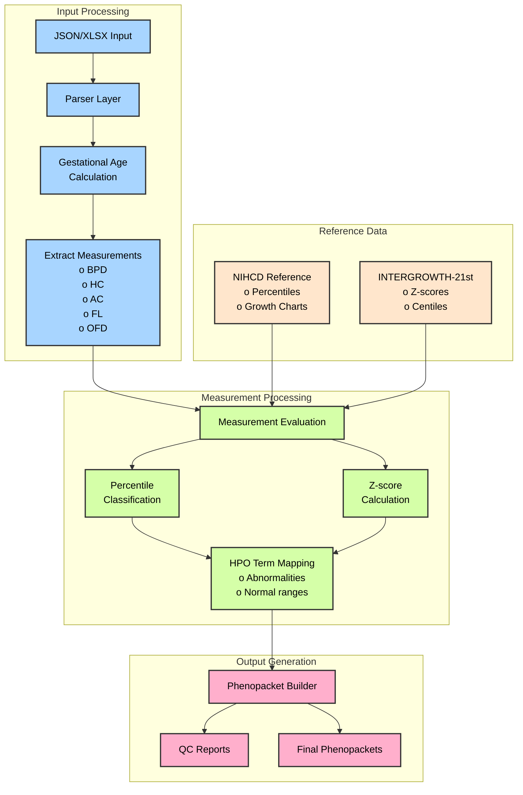
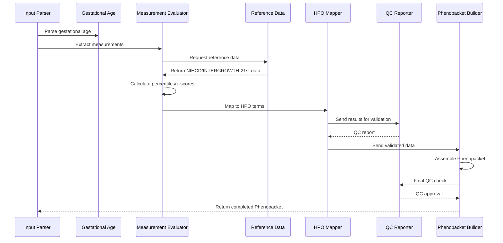
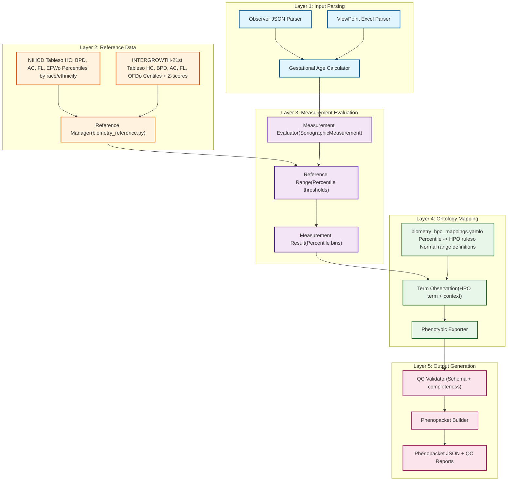
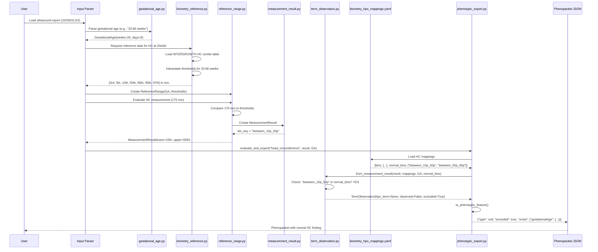
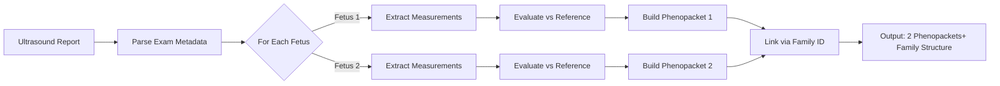
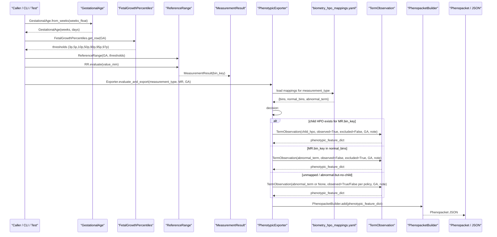
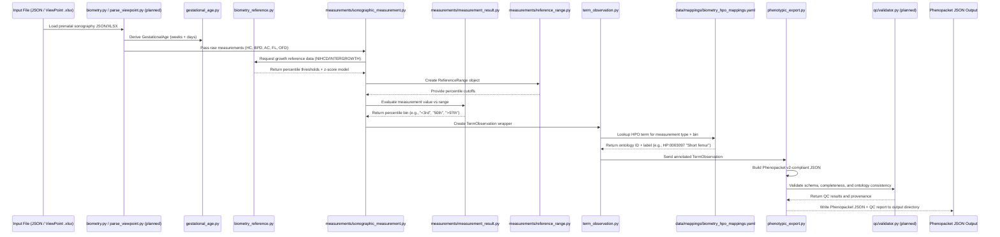
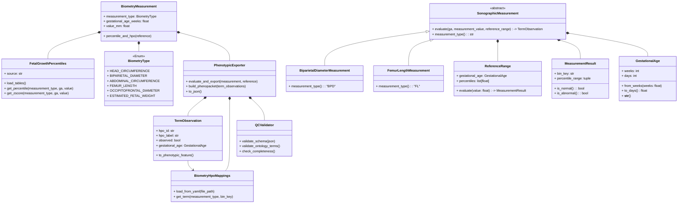
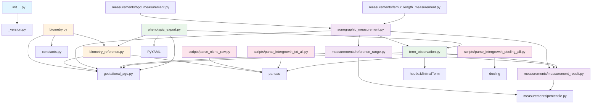

# prenatalppkt

A Python library for transforming raw prenatal sonography data into standardized [GA4GH Phenopackets (v2)](https://phenopacket-schema.readthedocs.io/) with clinically validated fetal growth references from NIHCD and INTERGROWTH-21st.

---

## Table of Contents

1. [Overview](#overview)
2. [Motivation](#motivation)
3. [Architecture](#architecture)
4. [Module Breakdown](#module-breakdown)
5. [Data Flow](#data-flow)
6. [Inputs and Outputs](#inputs-and-outputs)
7. [Installation](#installation)
8. [Usage Examples](#usage-examples)
9. [Testing](#testing)
10. [Future Roadmap](#future-roadmap)
11. [Contributing](#contributing)
12. [License](#license)
13. [Acknowledgments](#acknowledgments)
13. [Citation](#citation)
13. [Support](#support)
13. [Internal Layout](#internal-layout)


---

## Overview

`prenatalppkt` bridges the gap between clinical prenatal ultrasound measurements and machine-readable, ontology-aware phenotype representations. The library:

- **Standardizes biometric data** from multiple ultrasound reporting systems (Observer JSON, ViewPoint Excel)
- **Evaluates measurements** against authoritative growth references (NIHCD and INTERGROWTH-21st)
- **Maps percentile classifications** to Human Phenotype Ontology (HPO) terms
- **Generates GA4GH Phenopackets** with complete provenance and metadata

This enables federated genomic repositories to integrate prenatal phenotype data with whole exome/genome sequencing (WES/WGS) results in a consistent, computationally tractable format.

---

## Motivation

### Clinical Context

Prenatal ultrasound biometry provides critical developmental markers for fetal health assessment. Key measurements include:
- Head Circumference (HC)
- Biparietal Diameter (BPD)
- Abdominal Circumference (AC)
- Femur Length (FL)
- Occipito-Frontal Diameter (OFD)
- Estimated Fetal Weight (EFW)

### Technical Challenges

1. **Data heterogeneity**: Ultrasound systems export data in proprietary formats (ViewPoint Excel, Observer JSON)
2. **Reference ambiguity**: Multiple growth standards exist (NIHCD, INTERGROWTH-21st) with different population bases
3. **Ontology mapping**: Converting numeric percentiles to standardized phenotype terms requires domain expertise
4. **Genomic integration**: Linking prenatal observations to genetic data demands structured, machine-readable formats

### Solution

`prenatalppkt` provides a unified pipeline from raw measurements to Phenopackets, enabling:
- Reproducible phenotype analysis across institutions
- Integration with genomic variant interpretation workflows
- Federated data sharing with privacy-preserving pseudonymization
- Longitudinal tracking of fetal development

---

## Initial Design




---

## Architecture

The system implements a clean separation of concerns across five functional layers:


---

## Module Breakdown

### Core Modules (`src/prenatalppkt/`)

#### 1. **`__init__.py`**
Package initialization. Exposes version information.

#### 2. **`_version.py`** (auto-generated)
Version string managed by `setuptools_scm`. Current: `0.1.dev<TBD>`

#### 3. **`constants.py`**
Centralized ontology term identifiers, e.g.:
```python
HPO_MICROCEPHALY = "HP:0000252"
HPO_MACROCEPHALY = "HP:0000256"
HPO_SHORT_FETAL_FEMUR_LENGTH = "HP:0011428"
# ... additional terms
```

#### 4. **`gestational_age.py`**
Represents gestational age in standard obstetric notation (weeks + days):
```python
class GestationalAge:
   weeks: int  # Completed weeks since LMP
   days: int   # Additional days (0-6)
   
   @classmethod
   def from_weeks(cls, weeks_float: float) -> GestationalAge:
       """Convert decimal weeks (e.g., 20.86) to weeks+days format."""
       ...
```

**Why it matters**: Percentile tables index by gestational age. This class handles conversions and provides consistent formatting (e.g., "20w6d").

---

#### 5. **`biometry.py`**
High-level wrapper combining measurement types with reference lookups:
```python
class BiometryType(Enum):
   HEAD_CIRCUMFERENCE = "head_circumference"
   BIPARIETAL_DIAMETER = "biparietal_diameter"
   ABDOMINAL_CIRCUMFERENCE = "abdominal_circumference"
   FEMUR_LENGTH = "femur_length"
   OCCIPITOFRONTAL_DIAMETER = "occipitofrontal_diameter"
   ESTIMATED_FETAL_WEIGHT = "estimated_fetal_weight"

class BiometryMeasurement:
   def percentile_and_hpo(self, reference: FetalGrowthPercentiles) -> tuple[float, str | None]:
       """Look up percentile and apply abnormality rules (<=3rd or >=97th percentile)."""
       ...
```

**File interactions**:
- Calls `biometry_reference.py` to load growth tables
- Invokes `constants.py` for HPO term mappings
- Used by input parsers to convert raw measurements to clinical findings

---

#### 6. **`biometry_reference.py`**
Manages reference data loading and percentile/z-score lookups:
```python
class FetalGrowthPercentiles:
   source: str  # "intergrowth" or "nichd"
   tables: Dict[str, pd.DataFrame]
   
   def lookup_percentile(self, measurement_type: str, gestational_age_weeks: float, value_mm: float) -> float:
       """Return percentile (0-100) for a given measurement."""
       ...
   
   def get_zscore(self, measurement_type: str, gestational_age_weeks: float, value_mm: float) -> float:
       """Return z-score for INTERGROWTH-21st tables."""
       ...
```

**Data flow**:
1. On initialization, loads TSV files from `data/parsed/`
2. Normalizes column names across sources
3. Interpolates between gestational ages for non-tabled values
4. Provides unified API regardless of underlying reference standard

**Key design decision**: The class *owns* the reference data but *delegates* clinical interpretation to higher layers. It returns raw percentiles/z-scores without making clinical judgments.

---

### Measurement Evaluation Layer (`src/prenatalppkt/measurements/`)

This subsystem implements percentile-based classification using the Strategy pattern:

#### 7. **`percentile.py`**
Enumeration of standard percentile cutoffs:
```python
class Percentile(Enum):
   Third = "Third percentile"
   Fifth = "Fifth percentile"
   Tenth = "Tenth percentile"
   # ... up to Ninetyseventh
```

#### 8. **`measurement_result.py`**
Encapsulates which percentile interval a measurement falls into:
```python
class MeasurementResult:
   lower: Optional[Percentile]  # Lower bound (e.g., 5th percentile)
   upper: Optional[Percentile]  # Upper bound (e.g., 10th percentile)
   
   @property
   def bin_key(self) -> str:
       """Return semantic bin label: 'below_3p', 'between_5p_10p', etc."""
       ...
   
   @staticmethod
   def below_3p() -> MeasurementResult: ...
   @staticmethod
   def between_10p_50p() -> MeasurementResult: ...
   # ... factory methods for all standard intervals
```

**Why bins matter**: Different percentile ranges have different clinical meanings:
- `below_3p`: Severe abnormality (e.g., microcephaly)
- `between_3p_10p`: Mild concern
- `between_10p_90p`: Normal range
- `above_97p`: Macrosomia/overgrowth

---

#### 9. **`reference_range.py`**
Compares a numeric measurement to percentile thresholds:
```python
class ReferenceRange:
   gestational_age: GestationalAge
   percentile_thresholds: List[float]  # [3rd, 5th, 10th, 50th, 90th, 95th, 97th] in mm
   
   def evaluate(self, value: float) -> MeasurementResult:
       """Classify value into percentile bin."""
       if value < self.percentile_thresholds[0]:
           return MeasurementResult.below_3p()
       elif value < self.percentile_thresholds[1]:
           return MeasurementResult.between_3p_5p()
       # ... continue through all thresholds
```

**Critical logic**: This is where raw millimeter measurements become clinically meaningful categories. The class is agnostic to measurement type--it just compares numbers.

---

#### 10. **`sonographic_measurement.py`** (Abstract Base Class)
Defines the evaluation contract for all biometric measurements:
```python
class SonographicMeasurement(ABC):
   @abstractmethod
   def name(self) -> str:
       """Return canonical name (e.g., 'biparietal diameter')."""
       pass
   
   def evaluate(self, gestational_age: GestationalAge,
                measurement_value: float,
                reference_range: ReferenceRange) -> MeasurementResult:
       """Delegate to ReferenceRange, return MeasurementResult."""
       return reference_range.evaluate(measurement_value)
   
   def to_term_observation(self, result: MeasurementResult,
                           gestational_age: GestationalAge,
                           parent_term: Optional[MinimalTerm] = None) -> TermObservation:
       """Convert MeasurementResult to ontology-aware TermObservation."""
       ...
```

**Design rationale**:
- **Separation of concerns**: Numeric evaluation (percentile classification) is distinct from semantic interpretation (HPO mapping)
- **Extensibility**: New measurements (e.g., crown-rump length) just inherit and implement `name()`
- **Testability**: Can unit-test percentile logic without loading ontologies

---

#### 11. **`bpd_measurement.py`**
Concrete implementation for Biparietal Diameter:
```python
class BiparietalDiameterMeasurement(SonographicMeasurement):
   def name(self) -> str:
       return "biparietal diameter"
```

**That's it!** All evaluation logic is inherited. Future enhancements (e.g., asymmetry detection) would add methods here without touching the base class.

---

#### 12. **`femur_length_measurement.py`**
Analogous to BPD, demonstrates the pattern:
```python
class FemurLengthMeasurement(SonographicMeasurement):
   def name(self) -> str:
       return "femur length"
```

---

### Ontology Integration Layer

#### 13. **`term_observation.py`**
Bridges quantitative results with ontology terms:
```python
@dataclass
class TermObservation:
   hpo_term: Optional[MinimalTerm]
   observed: bool  # True = abnormality present, False = explicitly excluded
   gestational_age: GestationalAge
   parent_term: Optional[MinimalTerm] = None
   
   @staticmethod
   def from_measurement_result(measurement_result: MeasurementResult,
                                bin_to_term: Dict[str, MinimalTerm],
                                gestational_age: GestationalAge,
                                normal_bins: Set[str]) -> TermObservation:
       """
       Convert MeasurementResult to TermObservation using provided mappings.
       
       Logic:
       - If bin_key in normal_bins -> observed=False (excluded abnormality)
       - If bin_key has mapped term -> observed=True (confirmed abnormality)
       - Otherwise -> no term assigned
       """
       ...
   
   def to_phenotypic_feature(self) -> dict:
       """Serialize to Phenopacket PhenotypicFeature format."""
       return {
           "type": {"id": self.hpo_id, "label": self.hpo_label},
           "excluded": not self.observed,
           "onset": {"gestationalAge": {"weeks": self.gestational_age.weeks,
                                        "days": self.gestational_age.days}}
       }
```

**Critical design choice**: `normal_bins` is *injected* by the caller, not hardcoded. This allows:
- Population-specific definitions (e.g., INTERGROWTH vs NIHCD normal ranges differ)
- Study-specific thresholds (some cohorts may use 5th-95th as normal)
- Clinical context adjustments (high-risk pregnancies may have tighter criteria)

---

#### 14. **`phenotypic_export.py`**
High-level orchestrator that applies YAML-defined mappings:
```python
class PhenotypicExporter:
   source: str  # "intergrowth" or "nichd"
   mappings: Dict[str, Dict]  # Loaded from biometry_hpo_mappings.yaml
   
   def evaluate_and_export(self, measurement_type: str,
                           measurement_result: MeasurementResult,
                           gestational_age: GestationalAge) -> dict:
       """
       Apply YAML-defined rules to convert MeasurementResult to Phenopacket feature.
       
       Steps:
       1. Load mapping for measurement_type (e.g., "head_circumference")
       2. Extract bin_to_term mapping and normal_bins set
       3. Create TermObservation using TermObservation.from_measurement_result()
       4. Serialize to Phenopacket JSON
       """
       ...
```

**Why YAML configuration?**
- Clinical rules change over time (e.g., HPO term definitions are updated)
- Different institutions may use different cutoffs
- Non-programmers (clinicians, curators) can review and modify mappings
- Version control tracks rule changes independently of code

**Example `biometry_hpo_mappings.yaml` structure**:
```yaml
head_circumference:
 abnormal_term:
   id: "HP:0000240"
   label: "Abnormal skull morphology"
 bins:
   below_3p:
     id: "HP:0000252"
     label: "Microcephaly"
   above_97p:
     id: "HP:0000256"
     label: "Macrocephaly"
 normal_bins:
   - "between_10p_50p"
   - "between_50p_90p"
```

---

### Parsing Utilities (`src/prenatalppkt/scripts/`)

These scripts transform raw reference PDFs/text into normalized TSV files consumed by `biometry_reference.py`.

#### 15. **`parse_nichd_raw.py`**
Parses NIHCD plain-text tables into structured TSV:

**Input**: `data/raw/raw_NIHCD_feta_growth_calculator_percentile_range.txt`
```
Age (weeks) Race Measure 3rd 5th 10th 50th 90th 95th 97th
20 White Abdominal Circ 120 140 160 180 200 220 240
20 Black Abdominal Circ 115 135 155 175 195 215 235
...
```

**Output**: `data/parsed/raw_NIHCD_feta_growth_calculator_percentile_range.tsv`

**Key functions**:
```python
def is_header_or_junk(line: str) -> bool:
   """Detect and skip page headers, percentile labels, page numbers."""
   ...

def parse_line(line: str) -> Optional[List[str]]:
   """Extract [GA, race, measure, 7 percentiles] from mixed-format text."""
   # Handles: "20 White Abdominal Circ 120 140 160 180 200 220 240"
   # Returns: ["20", "White", "Abdominal Circ.", "120", ..., "240"]
   ...
```

**Challenges addressed**:
- Inconsistent whitespace (tab vs space delimiters)
- Multi-word measurements ("Abdominal Circ" vs "AbdominalCirc")
- Page artifacts (headers repeated on each page)

---

#### 16. **`parse_intergrowth_txt_all.py`**
Parses INTERGROWTH-21st text tables (one file per measure x table type):

**Input structure**:
```
data/raw/intergrowth21/
+-- hc_ct_table.txt      (Head Circumference centiles)
+-- hc_zs_table.txt      (Head Circumference z-scores)
+-- bpd_ct_table.txt
+-- bpd_zs_table.txt
... (5 measures x 2 table types = 10 files)
```

**Output**:
```
data/parsed/intergrowth_text/
+-- intergrowth21_hc_ct.tsv
+-- intergrowth21_hc_zs.tsv
... (10 TSV files)
```

**Key logic**:
```python
def parse_table(lines: List[str], headers: List[str], measure: str) -> pd.DataFrame:
   """
   Extract data rows, validate numeric columns, add provenance.
   
   Validation:
   - GA range: 14-40 weeks (INTERGROWTH standard)
   - Column count: Must match expected headers
   - Numeric coercion: Handle malformed values gracefully
   """
   records = []
   for line in lines:
       if is_data_line(line):
           row = line.split()
           if len(row) == len(headers):
               records.append(row)
   
   df = pd.DataFrame(records, columns=headers)
   df.insert(1, "Measure", measure)
   df = df.apply(pd.to_numeric, errors='coerce')
   df = df.dropna()  # Remove rows with unparseable values
   return df
```

**Why separate centile and z-score tables?**
- Centiles are used for clinical interpretation (percentiles)
- Z-scores enable statistical analysis (standard deviations from mean)
- Some research requires both (e.g., comparing growth trajectories)

---

#### 17. **`parse_intergrowth_docling_all.py`**
Alternative parser using the Docling library for ML/LLM-based PDF table extraction:
```python
from docling.document_converter import DocumentConverter

def build_converter(do_table_structure: bool, do_cell_matching: Optional[bool]) -> DocumentConverter:
   """
   Configure Docling pipeline with adaptive strategies.
   
   Strategies:
   1. structure+match: Use ML model for table reconstruction
   2. structure-no-match: Disable cell matching (faster, less accurate)
   3. no-structure: Raw text block extraction
   """
   ...

def try_extract_tables(pdf_path: Path) -> List[pd.DataFrame]:
   """
   Attempt extraction with fallback strategies.
   
   Why: Different INTERGROWTH PDFs have variable table quality.
   Some parse perfectly with ML, others need simpler heuristics.
   """
   for strategy in [(True, True), (True, False), (False, None)]:
       tables = extract_with_strategy(pdf_path, *strategy)
       if tables:
           return tables
   return []
```

**When to use this vs text parsing?**
- Docling: When source is PDF with complex layouts and using an LLM engine is acceptable
- Text parser: When source is already extracted text (faster, more reliable)

---

#### 18. **`normalize_tsv_to_csv.py`**
Post-processing utility to harmonize TSV outputs:
```python
def normalize_columns(df: pd.DataFrame) -> pd.DataFrame:
   """
   Standardize column names across sources.
   
   Transformations:
   - "Gestational age (weeks)" -> "Gestational Age (weeks)"
   - "3rd Pct" -> "3rd Percentile"
   - Handle Unicode artifacts (em-dashes, non-breaking spaces)
   """
   ...
```

---

### Quality Control (Planned: `src/prenatalppkt/qc/`)

**Not yet implemented**, but designed modules include:

- **`validator.py`**: Schema validation, ontology term checks, range validation
- **`completeness_checker.py`**: Flag missing required fields
- **`anomaly_detector.py`**: Statistical outliers, biologically implausible values

---

## Data Flow

### End-to-End Processing

The following sequence diagram illustrates how a single measurement flows through the system:


### Multi-Fetus Workflow

For twin/triplet pregnancies:


**Design decision**: One Phenopacket per fetus (default) vs one per pregnancy (configurable). This mirrors GA4GH's approach for multi-subject studies.

---

## Inputs and Outputs

### Basic Format:

#### Inputs
- **Observer JSON** (e.g. `data/EVMS_SAMPLE.json`)
- **ViewPoint Excel workbook** (`.xlsx` / `.xls`) with fetal biometry rows
- Typical sections:
  - * exam: DOB, LMP, GA by dates, exam date, ICD-10, referring clinicians
  - * fetuses[*]: anatomy blocks, measurements, vessels, procedures

#### Outputs
- **Phenopackets (v2)**: one JSON per fetus (default) or per pregnancy (configurable)
  * subject: pseudo-ID for fetus; optional family link/pedigree
  * phenotypicFeatures: HPO terms with gestational onset (via ontology mapping)
  * measurements: BPD / HC / AC / FL / OFD, EFW, ratios
  * diseases: ICD-10 indications; optional MONDO/OMIM mappings
  * metaData: versioning, ontology versions, pipeline provenance
- **QC reports** per input record with structured issues
- **Optional flat CSV** with per-fetus features for downstream analysis

No command-line interface is provided in this release.

### Input Formats

#### 1. Observer JSON
```json
{
 "exam": {
   "patient_dob": "1990-01-15",
   "lmp_date": "2024-03-10",
   "exam_date": "2024-08-15",
   "icd10_codes": ["Z34.00"]
 },
 "fetuses": [
   {
     "fetus_id": 1,
     "measurements": {
       "bpd_mm": 45.2,
       "hc_mm": 175.3,
       "ac_mm": 150.1,
       "fl_mm": 32.5
     },
     "anatomy": {
       "cranium": "normal",
       "heart": "four_chamber_view_normal"
     }
   }
 ]
}
```

#### 2. ViewPoint Excel (.xlsx)
| ExamDate   | LMP        | Fetus | BPD (mm) | HC (mm) | AC (mm) | FL (mm) |
|------------|------------|-------|----------|---------|---------|---------|
| 2024-08-15 | 2024-03-10 | 1     | 45.2     | 175.3   | 150.1   | 32.5    |

**Note**: ViewPoint uses proprietary dropdown lists (`.vpl` files) for anatomy findings. See `docs/viewpoint_dropdown_options.md` for conversion utilities.

---

### Output Format: GA4GH Phenopacket v2
```json
{
 "id": "prenatal-case-0000001-fetus-X",
 "subject": {
   "id": "fetus-0000001",
   "timeAtLastEncounter": {
     "gestationalAge": {
       "weeks": 22,
       "days": 3
     }
   }
 },
 "phenotypicFeatures": [
   {
     "type": {
       "id": "HP:0000252",
       "label": "Microcephaly"
     },
     "excluded": false,
     "onset": {
       "gestationalAge": {
         "weeks": 22,
         "days": 3
       }
     },
     "evidence": [
       {
         "evidenceCode": {
           "id": "ECO:0000033",
           "label": "author statement supported by traceable reference"
         },
         "reference": {
           "id": "PMID:29422205",
           "description": "The INTERGROWTH-21st fetal growth standards: toward the global integration of pregnancy and pediatric care"
         }
       }
     ]
   }
 ],
 "measurements": [
   {
     "assay": {
       "id": "LOINC:11984-2",
       "label": "Fetal Head Circumference US"
     },
     "value": {
       "quantity": {
         "unit": {
           "id": "UCUM:mm",
           "label": "millimeter"
         },
         "value": 165.0
       }
     },
     "timeObserved": {
       "gestationalAge": {
         "weeks": 22,
         "days": 3
       }
     }
   }
 ],
 "diseases": [
   {
     "term": {
       "id": "ICD10:Z34.00",
       "label": "Encounter for supervision of normal first pregnancy, unspecified trimester"
     }
   }
 ],
 "metaData": {
   "created": "2025-10-21T15:48:00Z",
   "createdBy": "prenatalppkt",
   "resources": [
     {"id": "hp",
       "name": "Human Phenotype Ontology",
       "url": "http://purl.obolibrary.org/obo/hp.owl",
       "version": "2024-09-01",
       "namespacePrefix": "HP",
       "iriPrefix": "http://purl.obolibrary.org/obo/hp.owl"
     },
     {
       "id": "loinc",
       "name": "Logical Observation Identifiers Names and Codes",
       "url": "http://loinc.org",
       "version": "2.81",
       "namespacePrefix": "LOINC",
       "iriPrefix": "http://loinc.org/rdf/"
     }
   ],
   "phenopacketSchemaVersion": "2.0"
 }
}
Additional Outputs
Quality Control Report (Planned)
json{
 "case_id": "prenatal-case-0000001",
 "validation_status": "PASS",
 "warnings": [
   {
     "field": "measurements.bpd_mm",
     "message": "BPD measurement at edge of reference range (2.8th percentile)",
     "severity": "LOW"
   }
 ],
 "completeness": {
   "required_fields": 12,
   "present_fields": 12,
   "missing_fields": []
 }
}
```

### Flat CSV Summary (Optional)
For downstream statistical analysis:
TBD: ~
```<case_idfetus_idga_weeksga_dayshc_mmhc_percentilehc_hpo_idbpd_mmbpd_percentile...case0011223165.02.1HP:000025245.28.5...>```

## Installation
Prerequisites

- Python >= 3.10
- pip package manager

### Standard Installation
```bash
# Clone repository
git clone https://github.com/P2GX/prenatalppkt.git
cd prenatalppkt
```

### Create virtual environment (recommended)
```bash
python -m venv venv
source venv/bin/activate  # On Windows: venv\Scripts\activate
```

### Install package in editable mode
```bash
pip install -e .
Development Installation
bash# Install with test dependencies
pip install -e ".[test]"
```

### Verify installation
```bash
pytest -v
```
Dependencies
Core dependencies (from pyproject.toml):
```toml
- click==8.2.1           # CLI framework
- hpo-toolkit==0.5.5     # HPO ontology utilities
- pandas==2.3.2          # Data manipulation
- phenopackets==2.0.2    # GA4GH Phenopacket schema
- pyphetools==0.9.118    # Phenotype analysis utilities
- PyYAML==6.0.2          # Configuration files
- rich==14.1.0           # Terminal formatting
```
Optional dependencies:
```toml
- docling==2.54.0        # PDF table extraction (for parse_intergrowth_docling_all.py)
- pytest==8.4.0          # Testing framework
- ruff==0.12.4           # Linting and formatting
```

## Usage Examples

```bash
# Example 1: Basic Measurement Evaluation
pythonfrom prenatalppkt.biometry import BiometryMeasurement, BiometryType
from prenatalppkt.biometry_reference import FetalGrowthPercentiles

# Initialize reference data (INTERGROWTH-21st)
reference = FetalGrowthPercentiles(source="intergrowth")

# Create measurement
measurement = BiometryMeasurement(
   measurement_type=BiometryType.HEAD_CIRCUMFERENCE,
   gestational_age_weeks=22.5,
   value_mm=196.3
)

# Evaluate against reference
percentile, hpo_term = measurement.percentile_and_hpo(reference=reference)

print(f"Head circumference at 22w3d: {percentile:.1f}th percentile")
if hpo_term:
   print(f"Abnormality detected: {hpo_term}")
else:
   print("Measurement within normal range")
```
```bash
# Output:
Head circumference at 22w3d: 52.3th percentile
Measurement within normal range
```

```bash
# Example 2: Using the Measurement Layer
pythonfrom prenatalppkt.gestational_age import GestationalAge
from prenatalppkt.measurements.reference_range import ReferenceRange
from prenatalppkt.measurements.bpd_measurement import BiparietalDiameterMeasurement

#### NIHCD BPD thresholds for 20.86 weeks (Non-Hispanic White)
thresholds = [145.25, 147.25, 150.37, 161.95, 174.41, 178.12, 180.56]
ga = GestationalAge.from_weeks(20.86)
reference_range = ReferenceRange(gestational_age=ga, percentiles=thresholds)

# Create measurement evaluator
bpd = BiparietalDiameterMeasurement()

# Evaluate measurement
result = bpd.evaluate(
   gestational_age=ga,
   measurement_value=170.0,
   reference_range=reference_range
)

print(f"BPD bin: {result.bin_key}")
print(f"Bounds: {result.lower.value if result.lower else 'None'} to {result.upper.value if result.upper else 'None'}")
```
```bash
# Output:
BPD bin: between_50p_90p
Bounds: Fiftieth percentile to Ninetieth percentile
```

```bash
# Example 3: Full Ontology Integration
pythonfrom prenatalppkt.gestational_age import GestationalAge
from prenatalppkt.biometry_reference import FetalGrowthPercentiles
from prenatalppkt.measurements.reference_range import ReferenceRange
from prenatalppkt.measurements.bpd_measurement import BiparietalDiameterMeasurement
from prenatalppkt.phenotypic_export import PhenotypicExporter

# # Setup
ga = GestationalAge.from_weeks(20.86)
reference = FetalGrowthPercentiles(source="intergrowth")

# Get reference thresholds
thresholds = reference.get_row("biparietal_diameter", ga.to_weeks())
reference_range = ReferenceRange(gestational_age=ga, percentiles=thresholds)

# Evaluate measurement
bpd = BiparietalDiameterMeasurement()
result = bpd.evaluate(ga, 140.0, reference_range)  # Very small BPD

# Export to Phenopacket format
exporter = PhenotypicExporter(source="intergrowth")
phenotypic_feature = exporter.evaluate_and_export(
   measurement_type="biparietal_diameter",
   measurement_result=result,
   gestational_age=ga
)

print(phenotypic_feature)
```
```bash
# Output:
{
 "type": {
   "id": "HP:0012369",
   "label": "Decreased biparietal diameter"
 },
 "excluded": false,
 "onset": {
   "gestationalAge": {"weeks": 20, "days": 6}
 }
}
```

```bash
# Example 4: Batch Processing Multiple Fetuses
pythonfrom prenatalppkt.biometry import BiometryMeasurement, BiometryType
from prenatalppkt.biometry_reference import FetalGrowthPercentiles
from prenatalppkt.gestational_age import GestationalAge

# Simulated ultrasound data
ultrasound_data = {
   "exam_date": "2024-08-15",
   "lmp_date": "2024-03-10",
   "fetuses": [
       {
           "id": 1,
           "measurements": {"hc_mm": 165.0, "bpd_mm": 45.2, "fl_mm": 32.5}
       },
       {
           "id": 2,
           "measurements": {"hc_mm": 198.0, "bpd_mm": 52.1, "fl_mm": 35.8}
       }
   ]
}

# Calculate gestational age
from datetime import datetime
lmp = datetime.fromisoformat(ultrasound_data["lmp_date"])
exam = datetime.fromisoformat(ultrasound_data["exam_date"])
ga_days = (exam - lmp).days
ga = GestationalAge.from_weeks(ga_days / 7)

# Initialize reference
reference = FetalGrowthPercentiles(source="intergrowth")

# Process each fetus
results = []
for fetus in ultrasound_data["fetuses"]:
   fetus_results = {"fetus_id": fetus["id"], "findings": []}
   
   for measure_type, value_mm in fetus["measurements"].items():
       # Map measurement names to BiometryType
       type_map = {
           "hc_mm": BiometryType.HEAD_CIRCUMFERENCE,
           "bpd_mm": BiometryType.BIPARIETAL_DIAMETER,
           "fl_mm": BiometryType.FEMUR_LENGTH
       }
       
       measurement = BiometryMeasurement(
           measurement_type=type_map[measure_type],
           gestational_age_weeks=ga.to_weeks(),
           value_mm=value_mm
       )
       
       percentile, hpo = measurement.percentile_and_hpo(reference=reference)
       
       fetus_results["findings"].append({
           "measurement": measure_type,
           "value": value_mm,
           "percentile": percentile,
           "hpo_term": hpo
       })
   
   results.append(fetus_results)

# Display results
import json
print(json.dumps(results, indent=2))

Example 5: Comparing NIHCD vs INTERGROWTH References
pythonfrom prenatalppkt.biometry import BiometryMeasurement, BiometryType
from prenatalppkt.biometry_reference import FetalGrowthPercentiles

# Same measurement evaluated against both references
ga_weeks = 28.0
hc_value = 265.0

measurement = BiometryMeasurement(
   measurement_type=BiometryType.HEAD_CIRCUMFERENCE,
   gestational_age_weeks=ga_weeks,
   value_mm=hc_value
)

# NIHCD evaluation
nihcd_ref = FetalGrowthPercentiles(source="nichd")
nihcd_pct, nihcd_hpo = measurement.percentile_and_hpo(reference=nihcd_ref)

# INTERGROWTH evaluation
intergrowth_ref = FetalGrowthPercentiles(source="intergrowth")
intergrowth_pct, intergrowth_hpo = measurement.percentile_and_hpo(reference=intergrowth_ref)

print(f"HC {hc_value} mm at {ga_weeks} weeks:")
print(f"  NIHCD:        {nihcd_pct:.1f}th percentile - {nihcd_hpo or 'Normal'}")
print(f"  INTERGROWTH:  {intergrowth_pct:.1f}th percentile - {intergrowth_hpo or 'Normal'}")
```
```bash
# Output (example):
HC 265.0 mm at 28.0 weeks:
NIHCD:        15.2th percentile - Normal
INTERGROWTH:  8.7th percentile - Normal

# Note: Differences reflect population composition:
# - NIHCD: U.S. multi-ethnic cohort
# - INTERGROWTH: International, optimally-nourished populations
```

## Testing
Running Tests
```bash
# Run all tests with verbose output
pytest -vv

# Run specific test module
pytest tests/test_biometry.py -v

# Run with coverage report
pytest --cov=prenatalppkt --cov-report=html

# Run linting and formatting checks
ruff format .
ruff check . --fix
```

### Test Coverage
Current test suite covers:
```bash
- Core Functionality Tests
- tests/test_biometry.py
```
```bash
Normal growth patterns (10th-90th percentile)
Microcephaly detection (<=3rd percentile)
Macrocephaly detection (>=97th percentile)
Short femur identification
Edge cases (missing data, out-of-range GA)
```

```bash
# tests/test_biometry_reference.py (planned)

NIHCD table loading
INTERGROWTH table loading
Percentile interpolation
Z-score calculation accuracy
Cross-reference consistency checks
```

```bash
#tests/test_phenotypic_export.py

HPO term assignment correctness
Normal range exclusion logic
YAML mapping application
Phenopacket JSON serialization
Batch export functionality
```

### Measurement Layer Tests
```bash
tests/test_bpd_measurement.py

Percentile bin classification (all 8 bins)
Boundary condition handling
Reference range integration
```

```bash
tests/test_femur_length_measurement.py

Similar coverage for femur length
Asymmetric ontology mapping (only lower abnormalities defined)
```

```bash
tests/test_reference_range.py

Threshold comparison logic
Edge value handling (exactly on threshold)
Invalid input rejection
```

```bash
tests/test_term_observation.py (planned)

MeasurementResult -> TermObservation conversion
Normal bin exclusion logic
Custom normal range definitions
Phenopacket feature serialization
```

### Parsing Tests
```bash
tests/test_parse_nichd_raw.py

Header/junk line detection
Multi-word measurement parsing
Race/ethnicity field extraction
Percentile value extraction
```

```bash
tests/test_parse_intergrowth_txt_all.py

Data line identification
GA range validation
Measure name normalization
Provenance metadata addition
```

### Test Data
```bash
# Test fixtures use validated reference values:
python# Example: NIHCD BPD at 20.86 weeks (Non-Hispanic White)
NIHCD_BPD_20_86_WEEKS = {
   "3rd": 145.25,
   "5th": 147.25,
   "10th": 150.37,
   "50th": 161.95,
   "90th": 174.41,
   "95th": 178.12,
   "97th": 180.56
}

# Example: INTERGROWTH HC z-scores at 22 weeks
INTERGROWTH_HC_22_WEEKS_ZSCORES = {
   "-3 SD": 169.2,
   "-2 SD": 179.5,
   "-1 SD": 189.8,
   "0 SD": 200.1,
   "+1 SD": 210.4,
   "+2 SD": 220.7,
   "+3 SD": 231.0
}
```

---

## Future Roadmap
```yaml
Phase 1: Core Functionality (Current Release)

Reference data loading (NIHCD, INTERGROWTH-21st)
Percentile-based evaluation
Basic HPO term mapping
Measurement layer architecture
YAML-driven ontology mappings
```
```yaml
Phase 2: Input Parsing (In Progress)

Observer JSON parser
ViewPoint Excel parser
Gestational age calculation from LMP/exam dates
Multi-fetus handling
Anatomy finding extraction (using ViewPoint dropdown lists)
```
```yaml
Phase 3: Quality Control (Planned Q1 2025)

Schema validation (JSON Schema, Protobuf)
Completeness checking (required fields, measurement coverage)
Range validation (biologically plausible values)
Anomaly detection (statistical outliers)
Cross-measurement consistency (e.g., BPD/HC ratio)
```
```yaml
Phase 4: Phenopacket Builder (Planned Q2 2025)

Full Phenopacket v2 assembly
Family/pedigree integration (twins, triplets)
ICD-10 -> MONDO/OMIM mapping
Provenance tracking (pipeline version, analyst ID)
Batch export utilities
```
```yaml
Phase 5: CLI and Web API (Planned Q3 2025)
bash# Command-line interface
prenatalppkt parse --input exam_data.json --output results/ --reference intergrowth

# Web API
POST /api/v1/evaluate
{
 "gestational_age_weeks": 22.5,
 "measurements": {"hc_mm": 196.3, "bpd_mm": 52.1}
}
-> Returns Phenopacket JSON
```
```yaml
Phase 6: Advanced Features (Planned Q4 2025)

Longitudinal growth tracking (serial ultrasounds)
Growth velocity calculations
Multi-parameter risk scoring
Predictive modeling integration (machine learning)
DICOM integration (extract measurements from ultrasound images)
```

## Contributing
### Development Workflow


```shell
# Fork the repository

git clone https://github.com/YOUR_USERNAME/prenatalppkt.git
cd prenatalppkt
git remote add upstream https://github.com/P2GX/prenatalppkt.git
```
```shell
# Create a feature branch

git checkout -b feature/add-efw-support
```
```shell
# Install development dependencies

pip install -e ".[test]"
pre-commit install  # If using pre-commit hooks
```
```shell
# Make changes and test
# Run tests
pytest -vv
```
```shell
# Check code style
ruff format .
ruff check . --fix
```

```shell
# Run full validation
ruff format . && ruff check . --fix && pytest -vv
```

```shell
# Commit with descriptive messages

git add src/prenatalppkt/measurements/efw_measurement.py
git commit -m "feat: Add estimated fetal weight (EFW) measurement support

- Implement EFWMeasurement class
- Add NIHCD reference tables for EFW
- Create HPO mappings for macrosomia/growth restriction
- Add unit tests with NICHD 28-week reference data

Closes #42"
```

```shell
# Push and create pull request
git push origin feature/add-efw-support
# Then create PR on GitHub
```

### Code Style Guidelines

Python: Follow PEP 8 (enforced by Ruff)
Docstrings: Use Sphinx format
Type hints: Required for all public functions
Line length: 88 characters (Black-compatible)

Example:
```python
pythondef evaluate(self, gestational_age: GestationalAge,
            measurement_value: float,
            reference_range: ReferenceRange) -> MeasurementResult:
   """
   Evaluate a raw measurement against the provided reference range.

   Parameters
   ----------
   gestational_age : GestationalAge
       The gestational age context for this measurement.
   measurement_value : float
       The observed measurement in millimeters.
   reference_range : ReferenceRange
       Percentile thresholds for this gestational age.

   Returns
   -------
   MeasurementResult
       Percentile bin classification for the measurement.

   Raises
   ------
   ValueError
       If measurement_value is negative or reference_range is invalid.
   """
   ...
````

### Adding New Measurements
To add support for a new biometric measurement (e.g., crown-rump length):

```python
# Create measurement class
src/prenatalppkt/measurements/crl_measurement.py
from prenatalppkt.sonographic_measurement import SonographicMeasurement

class CrownRumpLengthMeasurement(SonographicMeasurement):
   def name(self) -> str:
       return "crown_rump_length"
```

```shell
# Add reference data
# Parse source tables into data/parsed/
# Update biometry_reference.py to include CRL
```

### Define HPO mappings

```yaml
# data/mappings/biometry_hpo_mappings.yaml
crown_rump_length:
 abnormal_term:
   id: "HP:0001562"
   label: "Oligohydramnios"  # Example parent term
 bins:
   below_3p:
     id: "HP:0001511"
     label: "Intrauterine growth retardation"
 normal_bins:
   - "between_10p_50p"
   - "between_50p_90p"
```

### Add tests

```python
# tests/test_crl_measurement.py
def test_crl_below_3rd_percentile():
   ga = GestationalAge.from_weeks(12.0)
   thresholds = [...]  # Reference values
   reference = ReferenceRange(ga, thresholds)
   
   crl = CrownRumpLengthMeasurement()
   result = crl.evaluate(ga, 45.0, reference)
   
   assert result.bin_key == "below_3p"
```

## LICENSE
```shell
MIT License

## License

This project is released under a **dual-license model**:

- **Academic / Non-Commercial License:** Free to use, modify, and distribute for research and educational purposes.
- **Commercial License:** Required for commercial or for-profit use. Please contact [varenyajj@gmail.com](mailto:varenyajj@gmail.com).

Attribution required: (C) 2025 Varenya Jain, Peter N. Robinson.

For complete terms, see the [LICENSE](./LICENSE) file.
```
## Acknowledgments
Reference Standards

NICHD Fetal Growth Studies: U.S. National Institute of Child Health and Human Development
INTERGROWTH-21st Project: International consortium for fetal growth standards

Key Dependencies

HPO Toolkit: Human Phenotype Ontology integration
GA4GH Phenopackets: Standardized phenotype representation
PyPhetools: Phenotype analysis utilities from Monarch Initiative

## Contributors

- [Varenya Jain](https://orcid.org/0009-0000-4429-6024)
- [Peter N. Robinson](https://orcid.org/0009-0000-4429-6024)


## Citation
If you use prenatalppkt in your research, please cite:
```bibtex
@article{prenatalppkt
   author = {Jain, Varenya and Robinson, Peter N.},
   title = {prenatalppkt: Standardized Prenatal Phenotype Representation},
   year = {2025},
   url = {https://github.com/P2GX/prenatalppkt},
   version = {0.1.dev}
}
```
And cite the relevant reference standards:
```bibtex
@article{intergrowth2014,
   title={International standards for fetal growth based on serial ultrasound measurements: the INTERGROWTH-21st Project},
   author={Papageorghiou, Aris T and Ohuma, Eric O and others},
   journal={The Lancet},
   volume={384},
   number={9946},
   pages={869--879},
   year={2014},
   publisher={Elsevier}
}

@article{buck2015nichd,
 title={The NICHD Fetal Growth Studies: design, methods, and cohort description},
 author={Buck Louis, Germaine M and Grewal, Jagteshwar and others},
 journal={American Journal of Obstetrics and Gynecology},
 volume={213},
 number={4},
 pages={459--e1},
 year={2015}
}
```

## Support

```yaml
Documentation: https://github.com/P2GX/prenatalppkt/docs
Issue Tracker: https://github.com/P2GX/prenatalppkt/issues
Discussions: https://github.com/P2GX/prenatalppkt/discussions
Email: [Contact @VarenyaJ or @pnrobinson]
```

---

## Internal Layout









### Detailed Architecture: File-by-File Interactions

#### Scenario: Processing a Head Circumference Measurement

**Step 1: Input Parsing**
```
Input File (JSON/XLSX)
 ?
Parser extracts: GA=22.5 weeks, HC=196.3 mm
 ?
gestational_age.py::GestationalAge.from_weeks(22.5)
 -> Creates: GestationalAge(weeks=22, days=3)
```

**Step 2: Reference Data Loading**
```
biometry_reference.py::FetalGrowthPercentiles.__init__(source="intergrowth")
 ?
biometry_reference.py::_load_intergrowth()
 ?
Reads: data/parsed/intergrowth_text/intergrowth21_hc_ct.tsv
 ?
biometry_reference.py::_normalize_columns()
 -> Standardizes: "GA (weeks)" -> "Gestational Age (weeks)"
 ?
Stores in: self.tables["head_circumference"]
```

**Step 3: Percentile Threshold Retrieval**
```
biometry_reference.py::get_row("head_circumference", 22.5)
 ?
If 22.5 not in table (e.g., only 22 and 23 exist):
 ?
biometry_reference.py::_interpolate_row(22.5, row_22, row_23)
 -> Linear interpolation between adjacent GAs
 ?
Returns: [3rd, 5th, 10th, 50th, 90th, 95th, 97th] percentile values in mm
```

**Step 4: Percentile Bin Classification**
```
measurements/reference_range.py::ReferenceRange(ga, thresholds)
 ?
measurements/reference_range.py::evaluate(196.3)
 ?
Compares 196.3 to thresholds:
 if value < thresholds[0]: return MeasurementResult.below_3p()
 elif value < thresholds[1]: return MeasurementResult.between_3p_5p()
 ... [continues through all thresholds]
 else: return MeasurementResult.above_97p()
 ?
Assuming 196.3 falls between 10th and 50th:
 ?
measurements/measurement_result.py::MeasurementResult(lower=Tenth, upper=Fiftieth)
 -> bin_key = "between_10p_50p"
```

**Step 5: Ontology Mapping**
```
phenotypic_export.py::evaluate_and_export("head_circumference", result, ga)
 ?
Loads: data/mappings/biometry_hpo_mappings.yaml
 ?
Extracts for "head_circumference":
 - bins: {below_3p: HP:0000252, above_97p: HP:0000256, ...}
 - normal_bins: ["between_10p_50p", "between_50p_90p"]
 - abnormal_term: HP:0000240 (Abnormal skull morphology)
 ?
term_observation.py::from_measurement_result(
   measurement_result=result,
   bin_to_term=bins,
   gestational_age=ga,
   normal_bins=normal_bins
)
 ?
Logic:
 if result.bin_key in normal_bins:
   observed = False  # This is a normal finding
   hpo_term = None   # No abnormality to report
 elif result.bin_key in bins:
   observed = True
   hpo_term = bins[result.bin_key]
 else:
   observed = True
   hpo_term = abnormal_term (fallback)
 ?
Since "between_10p_50p" is in normal_bins:
 ?
term_observation.py::TermObservation(
   hpo_term=None,
   observed=False,
   excluded=True,
   gestational_age=GestationalAge(22, 3)
)
```

**Step 6: Phenopacket Serialization**
```
term_observation.py::to_phenotypic_feature()
 ?
Returns:
{
 "type": null,  # No abnormal term
 "excluded": true,  # Explicitly marked as normal
 "onset": {
   "gestationalAge": {"weeks": 22, "days": 3}
 }
}
```

### Module Dependency Graph



#